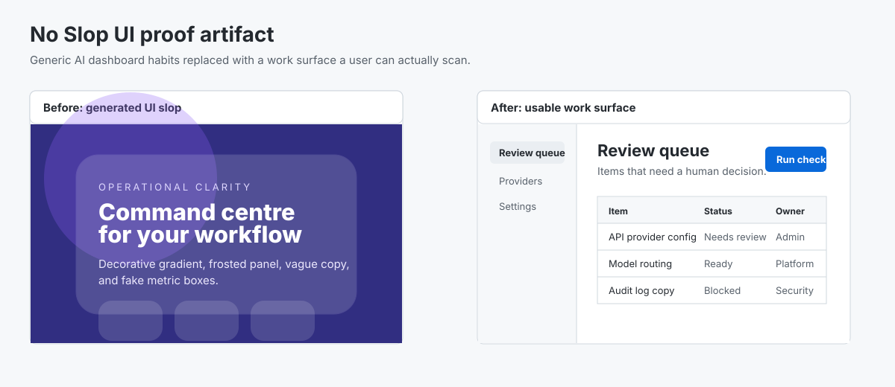

# no-slop-ui


**Stop AI agents shipping generic frontend sludge.**

`no-slop-ui` is a small design guardrail for Codex, Claude Code, OpenClaw, and other coding agents. It gives the agent concrete rules before it builds a visible UI, then gives the reviewer a checklist before the work is accepted.

Use it when an AI coding agent reaches for glass panels, purple gradients, oversized cards, fake dashboards, vague SaaS copy, or hero sections where a real product screen should be.

## Start Here

```bash
git clone https://github.com/LeoStehlik/no-slop-ui.git
cd no-slop-ui
python3 scripts/validate_skill_repo.py
open examples/before-after.html
```

For agent work, paste or reference [`SKILL.md`](SKILL.md), then review the output with [`examples/review-checklist.md`](examples/review-checklist.md).

```text
Read no-slop-ui/SKILL.md before changing this UI. Build the actual product screen first. Avoid decorative gradients, glass panels, nested cards, oversized radius, fake metrics, and vague SaaS copy. After the change, run the no-slop-ui checklist and report any failures before calling it done.
```

## Credibility Artifact



The full proof artifact is in [`docs/conversion-proof.md`](docs/conversion-proof.md). It shows the exact before/after UI failure, the review notes, the checklist verdict, and the concrete changes that move an AI-looking dashboard toward a usable work surface.

## What It Blocks

- Glassmorphism and frosted panels
- Decorative gradient backgrounds, gradient text, and glow
- Huge rounded cards and floating shells
- Hero sections inside internal dashboards
- Fake metric grids that fill space but do not support the task
- Eyebrow labels and vague SaaS filler copy
- Transform, bounce, scale, or spring hover effects
- One-hue purple/blue-dark palettes that read as generic AI output

Full list: [`references/banned-patterns.md`](references/banned-patterns.md).

## Works With

No Slop UI is framework-agnostic. It is a rule set and review surface, not a component library.

| Surface | Use it how |
| --- | --- |
| Codex | Add `SKILL.md` to repo instructions or the task brief before UI work starts. |
| Claude Code | Add the skill rules to project memory or paste the quick prompt from [`docs/agent-snippets.md`](docs/agent-snippets.md). |
| OpenClaw | Install as a workspace skill and invoke it for frontend implementation or review. |
| Cursor / custom agents | Paste the short guardrail prompt and require the checklist verdict in the final response. |

Frontend stacks it fits: React, Next.js, Vue, Svelte, Tailwind, shadcn/ui, plain HTML/CSS dashboards, and internal tools.

## Tiny Agent Snippets

Copy the relevant snippet from [`docs/agent-snippets.md`](docs/agent-snippets.md):

- Codex repo instruction
- Claude Code project instruction
- OpenClaw skill usage
- Cursor/custom-agent prompt
- Pull-request review prompt

## Review Checklist

Use [`examples/review-checklist.md`](examples/review-checklist.md) after an agent generates or edits UI.

A simple rule: if two or more checklist sections fail, revise before calling the UI done.

## Installation

### OpenClaw

Clone this repo into a loaded skills directory:

```bash
git clone https://github.com/LeoStehlik/no-slop-ui.git /path/to/your/skills/no-slop-ui
```

Then use it when the task is explicitly about UI design, frontend implementation, visual polish, or design review.

### Codex / Claude Code / other agents

Reference the skill directly in your task:

```text
Read no-slop-ui/SKILL.md before building this interface.
```

Or paste the focused snippets from [`docs/agent-snippets.md`](docs/agent-snippets.md).

## Repository Map

```text
no-slop-ui/
├── SKILL.md                         Core rules and activation boundary
├── references/
│   ├── banned-patterns.md           Full banned list with examples
│   └── colour-palettes.md           Conservative palettes when no system exists
├── examples/
│   ├── before-after.html            Browser-openable before/after demo
│   ├── review-checklist.md          Fast acceptance checklist
│   └── README.md                    Example index
├── docs/
│   ├── agent-snippets.md            Copy-paste setup snippets
│   └── conversion-proof.md          v0.3 proof artifact and checklist verdict
├── assets/
│   └── no-slop-ui-before-after.svg  README proof image
└── scripts/
    └── validate_skill_repo.py       Link and metadata validator
```

## The Standard

Think Linear, Raycast, Stripe, GitHub. They do not try to look clever. They make the work legible.

Good generated UI usually has:

- Stable sidebar or toolbar dimensions
- Clear type hierarchy with normal product-scale text
- Solid surfaces, subtle borders, restrained shadows
- Buttons with 6-10px radius, no gradients, no pills everywhere
- Tables, forms, menus, filters, and tabs that behave like familiar software
- Responsive constraints that stop text and controls from overlapping
- Direct labels and headings that describe the user task

## When To Use Which Repo

| Need | Use |
| --- | --- |
| Turn a fuzzy request into an executable agent brief | [Brief Master](https://github.com/LeoStehlik/brief-master) |
| Prove one coding task is actually done | [Proof Loop](https://github.com/LeoStehlik/proof-loop) |
| Improve repeated agent behaviour with evals | [Loopsmith](https://github.com/LeoStehlik/loopsmith) |
| Keep source-backed memory for long-running agents | [Sovereign Brain](https://github.com/LeoStehlik/decoupled-agent-memory) |
| Stop frontend agents producing generic UI sludge | [no-slop-ui](https://github.com/LeoStehlik/no-slop-ui) |

A practical chain: Brief Master writes the UI task, No Slop UI constrains the visual output, Proof Loop verifies the work, Loopsmith turns repeated failures into evals, and Sovereign Brain keeps the durable lesson.

## Inspiration

Inspired by [Uncodixfy](https://github.com/cyxzdev/Uncodixfy) by cyxzdev. Built as our own take: smaller, stricter, and aimed at agent-generated production UI.

## License

MIT - see [LICENSE](LICENSE).
