# PHASE 7A: 56 ENGLISH PAGES SEO BASELINE AUDIT & KEYWORD CLUSTER MAPPING REPORT
# Target Platform: freeiqexam.com (56 English Routes in src/pages/*.astro)
# Authority Standards: 2026 Google Search Essentials, People-First Content & Sovereign Baseline (Commit 857dc4b)
# Primary Research Assets:
#   - e:/Antigravity/Fashion Deals Website/SEO_ENGLISH_EXPANDED_29_TOOLS_RESEARCH.json (634+ Verified Keywords)
#   - e:/Antigravity/Fashion Deals Website/SEO_ENGLISH_MASTER_RESEARCH.md
# Mode: READ-ONLY AUDIT & TOPICAL MAPPING (ZERO SOURCE CODE MODIFICATIONS)
# Generated: 2026-09-18

---

## 📊 1. EXECUTIVE AUDIT SUMMARY & STATISTICAL OVERVIEW

```text
======================================================================
      PHASE 7A: 56 ENGLISH PAGES SEO BASELINE & KEYWORD MAPPING
======================================================================

Summary Statistics:
  - Total English Routes Audited:     56 / 56
  - Bucket 1 (Mega-Volume Landing):   15 Pages
  - Bucket 2 (Specialized Batteries): 12 Pages
  - Bucket 3 (Statistical / Authority): 10 Pages
  - Bucket 4 (11 Brain Games Hub):    11 Pages
  - Bucket 5 (Entity & Trust):        4 Pages
  - Bucket 6 (Compliance / Exempt):   4 Pages (Preserved strictly as-is)
  - Total Monthly Search Volume:      14,800,000+ Monthly Queries
  - Zero Source Code Edits:           Verified (Read-Only Blueprint Phase)
======================================================================
```

### 🎯 Key Baseline Audit Findings & Strategic Corrections

1. **Elimination of Arbitrary Keyword Density (1.0%–1.8%)**:
   - In alignment with 2026 Google Search Essentials and Spam Policies, rigid density targets are entirely abandoned. Keyword stuffing or unnatural phrase repetitions degrade user experience and trigger quality demotions. All proposed targets emphasize natural topical breadth, natural syntax, and search-intent satisfaction.

2. **Concise, Compelling & Accurate Metadata**:
   - Modern Google SERPs frequently rewrite titles or construct snippet previews dynamically based on query context. Proposed titles and meta descriptions are crafted to be punchy, accurate, and value-packed without arbitrary character-count stress.

3. **Schema.org Modernization (Purging Deprecated FAQPage Reliance)**:
   - **Critical 2026 Reality**: Google deprecated FAQ rich results in May 2026, severely restricting structured data visibility for FAQ items. While visible FAQ accordions remain valuable for user education and natural long-tail answers, structured data must focus on genuine, Google-supported schemas: `WebApplication`, `MedicalWebPage`, `Quiz`, `Article`, `TechArticle`, `ItemList`, and `Organization`.
   - 30 pages currently include `FAQPage` schema; these will be gracefully refactored to focus on `WebApplication` and `MedicalWebPage` in Phase 7B.

4. **Identified Content Gaps (Thin Test Runners)**:
   - `/test` (117 words) and `/quick-test` (112 words) currently operate as pure test runners with almost no descriptive or educational content. While the interactive tests work smoothly, search engines require introductory context, scoring scale explanations, and psychometric background to award high topical authority.
   - `/fluid-reasoning-test` (278 words) and `/quantitative-reasoning-test` (297 words) also require expanded explanatory sections detailing CHC constructs, sample problem breakdowns, and real-world relevance.

---

## 🗂️ 2. MASTER 56-PAGE COMPARATIVE SEO MAPPING TABLE

| # | Route | Bucket | Primary Target Query | Search Vol | CPC | Current Title | Proposed Title | Proposed Schema |
|---|---|---|---|---|---|---|---|---|
| 1 | `/` | Bucket 1 | **iq test** | 368,000 | $1.87 | Free IQ Test Online 2026 - Instant ... | Free IQ Test Online 2026: Instant R... | `WebApplication, ItemList, Organization` |
| 2 | `/adhd-test` | Bucket 1 | **adhd test** | 165,000 | $0.73 | Adult ADHD Test Online - Free WHO A... | Free ADHD Test Online: Adult ADHD S... | `MedicalWebPage, Quiz` |
| 3 | `/autism-test` | Bucket 1 | **autism test** | 301,000 | $0.29 | Autism Test Online - Free AQ-10 Adu... | Free Autism Test Online: Adult Auti... | `MedicalWebPage, Quiz` |
| 4 | `/brown-noise` | Bucket 1 | **brown noise** | 110,000 | $0.30 | Free Brown Noise Generator Online |... | Free Brown Noise Generator: Deep So... | `WebApplication` |
| 5 | `/calorie-calculator` | Bucket 1 | **calorie calculator** | 1,000,000 | $0.82 | Free TDEE & Calorie Calculator | Da... | Free Calorie Calculator & TDEE Defi... | `WebApplication` |
| 6 | `/color-blind-test` | Bucket 1 | **color blind test** | 201,000 | $0.44 | Color Blind Test – Free Official Is... | Free Color Blind Test: Official Ish... | `MedicalWebPage, WebApplication` |
| 7 | `/depression-test` | Bucket 1 | **depression test** | 135,000 | $0.98 | Free Clinical Depression Test (PHQ-... | Free Depression Test Online: Confid... | `MedicalWebPage, Quiz` |
| 8 | `/games/click-speed-test` | Bucket 1 | **cps test** | 110,000 | $0.90 | Click Speed Test (CPS) - Free Click... | CPS Test: Free Click Speed Test & C... | `WebApplication` |
| 9 | `/memento-mori` | Bucket 1 | **memento mori** | 201,000 | $0.11 | Free Memento Mori Calendar | Intera... | Memento Mori Life Calendar: Free Li... | `WebApplication` |
| 10 | `/mic-test` | Bucket 1 | **mic test** | 135,000 | $0.62 | Free Online Microphone Test & Audio... | Free Mic Test Online: Instant Micro... | `WebApplication` |
| 11 | `/quick-test` | Bucket 1 | **quick iq test** | 6,600 | $1.81 | Quick IQ Test: Fast 10-Minute Free ... | Quick IQ Test: Free 5-Minute Fast C... | `WebApplication, Quiz` |
| 12 | `/reaction-time-test` | Bucket 1 | **reaction time test** | 74,000 | $0.69 | Reaction Time Test Online - Test Yo... | Reaction Time Test: Free Online Ref... | `WebApplication` |
| 13 | `/sleep-calculator` | Bucket 1 | **sleep calculator** | 110,000 | $0.32 | Free Sleep Calculator | Optimal Bed... | Free Sleep Calculator: Sleep Cycle ... | `WebApplication` |
| 14 | `/test` | Bucket 1 | **online iq test** | 9,900 | $2.54 | Free Online IQ Test: 24 Questions, ... | Online IQ Test: Full 24-Question St... | `WebApplication, Quiz` |
| 15 | `/typing-test` | Bucket 1 | **typing test** | 550,000 | $0.59 | Free Typing Speed Test (WPM) Online... | Free Typing Test Online: 1-Minute W... | `WebApplication` |
| 16 | `/aim-trainer` | Bucket 2 | **aim trainer** | 49,500 | $0.48 | Free Online FPS Aim Trainer | Mouse... | Free Online FPS Aim Trainer: Mouse ... | `WebApplication` |
| 17 | `/anxiety-test` | Bucket 2 | **anxiety test** | 49,500 | $0.62 | Free Clinical Anxiety Test (GAD-7) ... | Free Clinical Anxiety Test (GAD-7) ... | `MedicalWebPage, Quiz` |
| 18 | `/circle-of-control` | Bucket 2 | **circle of control** | 6,600 | $0.35 | Circle of Control Test: Free Stoic ... | Circle of Control Test: Free Stoic ... | `WebApplication` |
| 19 | `/eye-test` | Bucket 2 | **eye test online** | 14,800 | $0.85 | Free Online Eye Test & Visual Acuit... | Free Online Eye Test: Visual Acuity... | `MedicalWebPage, WebApplication` |
| 20 | `/flag-quiz` | Bucket 2 | **flag quiz** | 49,500 | $0.28 | World Flag Quiz & Geographic Memory... | World Flag Quiz: Interactive 195-Co... | `WebApplication, Quiz` |
| 21 | `/fluid-reasoning-test` | Bucket 2 | **fluid intelligence test** | 260 (590 broad) | $1.59 | Fluid Reasoning Test Free - 16 Matr... | Fluid Reasoning Test Free: 16 Patte... | `WebApplication, Quiz` |
| 22 | `/hearing-test` | Bucket 2 | **hearing test online** | 18,100 | $0.77 | Free Online Hearing Test & Ear Age ... | Free Online Hearing Test & Ear Age ... | `MedicalWebPage, WebApplication` |
| 23 | `/matrix-reasoning-test` | Bucket 2 | **matrix reasoning test** | 210 (1,000 broad) | $0.88 | Matrix Reasoning Test: Guide, Rules... | Matrix Reasoning Test: Free Abstrac... | `WebApplication, Quiz` |
| 24 | `/mensa-iq-test-practice` | Bucket 2 | **mensa iq test** | 27,100 | $1.65 | Mensa Practice Test: Free Mensa-Sty... | Mensa Practice Test: Free Mensa-Sty... | `WebApplication, Quiz` |
| 25 | `/quantitative-reasoning-test` | Bucket 2 | **quantitative reasoning test** | 1,000 | $2.14 | Quantitative Reasoning Test Free - ... | Quantitative Reasoning Test Free: N... | `WebApplication, Quiz` |
| 26 | `/spatial-reasoning-test` | Bucket 2 | **spatial reasoning test** | 1,300 | $4.06 | Spatial Reasoning Test Free - 3D Ro... | Spatial Reasoning Test Free: 3D Men... | `WebApplication, Quiz` |
| 27 | `/verbal-reasoning-test` | Bucket 2 | **verbal reasoning test** | 3,600 | $1.85 | Verbal Reasoning Test Free - Analog... | Verbal Reasoning Test Free: Analogi... | `WebApplication, Quiz` |
| 28 | `/average-iq-by-age` | Bucket 3 | **average iq by age** | 14,800 | $0.45 | Average IQ by Age: Cognitive Trajec... | Average IQ by Age: Cognitive Trajec... | `Article` |
| 29 | `/high-iq-societies` | Bucket 3 | **high iq societies** | 1,900 | $0.70 | High IQ Societies Guide: Mensa, Int... | High IQ Societies Guide: Mensa, Int... | `Article` |
| 30 | `/iq-classification-scale` | Bucket 3 | **iq scale** | 14,800 | $0.80 | IQ Score Classification Scale: WAIS... | IQ Score Classification Scale: WAIS... | `Article` |
| 31 | `/iq-percentile-calculator` | Bucket 3 | **iq percentile calculator** | 2,400 | $0.85 | IQ to Percentile Calculator - Conve... | IQ to Percentile Calculator: Instan... | `WebApplication` |
| 32 | `/iq-score-chart` | Bucket 3 | **iq score chart** | 14,800 | $0.65 | IQ Score Chart: Normal Distribution... | IQ Score Chart: Normal Distribution... | `Article` |
| 33 | `/leaderboard` | Bucket 3 | **iq test leaderboard** | 260 | $0.30 | Global Cognitive Benchmarks - Illus... | Global Cognitive Benchmarks: Commun... | `CollectionPage` |
| 34 | `/methodology` | Bucket 3 | **psychometric testing methodology** | 320 (260 iq scoring) | $1.40 | Psychometric Methodology & 2PL IRT ... | Psychometric Methodology & 2PL IRT ... | `TechArticle, AboutPage` |
| 35 | `/practice` | Bucket 3 | **iq test practice questions** | 4,400 | $1.20 | Cognitive Practice Hub - Free IQ Te... | Cognitive Practice Hub: Free IQ Tes... | `WebApplication, Quiz` |
| 36 | `/results` | Bucket 3 | **iq test results breakdown** | 480 | $0.95 | Your IQ Test Score Report & Psychom... | Your IQ Test Score Report & Psychom... | `WebApplication` |
| 37 | `/tools` | Bucket 3 | **free cognitive tests and tools** | 1,200 | $0.75 | Free Cognitive Tools & Bio-Calculat... | Free Cognitive Tools & Bio-Calculat... | `CollectionPage, ItemList` |
| 38 | `/games` | Bucket 4 | **brain games** | 74,000 | $0.45 | Free Brain Training Games - 10 Cogn... | Free Brain Training Games: 11 Cogni... | `CollectionPage, ItemList` |
| 39 | `/games/digit-span` | Bucket 4 | **digit span test** | 4,400 | $1.25 | Digit Span Test Online Free - Worki... | Digit Span Test Online Free: Workin... | `WebApplication` |
| 40 | `/games/flanker-test` | Bucket 4 | **flanker test** | 2,900 | $0.60 | Flanker Test Online Free - Selectiv... | Flanker Test Online Free: Eriksen S... | `WebApplication` |
| 41 | `/games/math-sprint` | Bucket 4 | **mental math test** | 6,600 | $0.40 | Mental Math Speed Test Free - Rapid... | Mental Math Speed Test Free: 60-Sec... | `WebApplication` |
| 42 | `/games/memory-matrix` | Bucket 4 | **visual memory test** | 12,100 | $0.65 | Memory Matrix Training Free - Visuo... | Memory Matrix Training Free: Visuos... | `WebApplication` |
| 43 | `/games/n-back` | Bucket 4 | **dual n back** | 14,800 | $0.70 | Dual N-Back Free Online - Working M... | Dual N-Back Free Online: Working Me... | `WebApplication` |
| 44 | `/games/rotation` | Bucket 4 | **mental rotation test** | 4,400 | $0.80 | Mental Rotation Test Free - 3D Spat... | Mental Rotation Test Free: 3D Spati... | `WebApplication` |
| 45 | `/games/sequence-rush` | Bucket 4 | **sequence memory test** | 9,900 | $0.55 | Number Series Test Free - Inductive... | Sequence Memory Test Free: Inductiv... | `WebApplication` |
| 46 | `/games/stroop-clash` | Bucket 4 | **stroop test** | 27,100 | $0.75 | Stroop Test Online Free - Color Int... | Stroop Test Online Free: Color Inte... | `WebApplication` |
| 47 | `/games/syllogism` | Bucket 4 | **syllogism test** | 2,400 | $0.70 | Deductive Reasoning Test Free - Syl... | Deductive Reasoning Test Free: Syll... | `WebApplication` |
| 48 | `/games/symbol-match` | Bucket 4 | **processing speed test** | 2,400 | $0.85 | Perceptual Speed Test Free - Symbol... | Perceptual Speed Test Free: Symbol ... | `WebApplication` |
| 49 | `/about` | Bucket 5 | **about freeiqexam** | 300 (Navigational / Brand) | $0.00 | About FreeIQExam - Psychometric Sta... | About FreeIQExam: Psychometric Stan... | `AboutPage, Organization` |
| 50 | `/blog` | Bucket 5 | **cognitive science blog** | 880 (Informational) | $0.60 | Cognitive Science & Psychometrics B... | Cognitive Science & Psychometrics B... | `Blog, CollectionPage` |
| 51 | `/contact` | Bucket 5 | **contact freeiqexam** | 150 (Navigational) | $0.00 | Contact FreeIQExam - Psychometric S... | Contact FreeIQExam: Psychometric Su... | `ContactPage` |
| 52 | `/profile` | Bucket 5 | **personal cognitive profile** | 100 (Internal / Local Utility) | $0.00 | Personal Cognitive Profile & Activi... | Personal Cognitive Profile & Activi... | `ProfilePage` |
| 53 | `/404` | Bucket 6 | **EXEMPT (404 Page Not Found)** | N/A | N/A | Page Not Found (404) | FreeIQExam | Page Not Found (404) | FreeIQExam | `None` |
| 54 | `/preview-master-v3` | Bucket 6 | **EXEMPT (Internal Staging Preview)** | N/A | N/A | Free IQ Test Online 2026 - Instant ... | Free IQ Test Online 2026 (Staging P... | `None` |
| 55 | `/privacy` | Bucket 6 | **EXEMPT (Privacy Policy)** | N/A | N/A | Privacy Policy: Client-Side Evaluat... | Privacy Policy: Client-Side Evaluat... | `WebPage` |
| 56 | `/terms` | Bucket 6 | **EXEMPT (Terms of Service)** | N/A | N/A | Terms of Service & Clinical Disclai... | Terms of Service & Clinical Disclai... | `WebPage` |

---

## 📋 3. DETAILED PAGE-BY-PAGE AUDIT & OPTIMIZATION BLUEPRINTS


### 🏷️ BUCKET 1: MEGA-VOLUME INTERACTIVE LANDING PAGES

#### 📍 Page / (`src/pages/index.astro`)

- **Intent Category & Priority**: Bucket 1: Mega-Volume Interactive Landing Pages | **P0 - Flagship Core Assessment**
- **Topical Cluster Hub**: Core Cognitive Hub
- **Current Content Metrics**: Word Count: **2803 words** | Heading Structure: **9 H2s, 12 H3s** | Has FAQ: **Yes** | Schemas: `None`

##### 🎯 Keyword Cluster & Search Intent
- **Primary Head Term**: **`iq test`** (Monthly Vol: **368,000** | CPC: **$1.87**)
- **Secondary Cluster**: `free iq test (90.5k)`, `online iq test (9.9k)`, `test of iq (368k)`, `iq exam (368k)`, `free iq test online (33.1k)`
- **Long-Tail Semantic Queries**:
  - *free online iq test instant results no email*
  - *standardized 24 question online iq test 2026*
  - *item response theory scientifically validated iq test*
  - *real iq test with percentile breakdown free*

##### 🏷️ Metadata & Heading Audit
- **Current Title**: `Free IQ Test Online 2026 - Instant Results, No Email Required | FreeIQExam`
- **Proposed Title**: **`Free IQ Test Online 2026: Instant Results, No Email Required | FreeIQExam`**
- **Current Meta Description**: `Take a free, scientifically grounded online IQ test. 24 standardized items scored with 2PL Item Response Theory. Instant score, percentile and cognitive breakdown, plus 30+ free brain games, clinical screeners and wellness tools. Zero paywall.`
- **Proposed Meta Description**: *"Take our free, scientifically validated online IQ test. 24 standardized questions scored via 2PL Item Response Theory. Instant score, percentile, and CHC breakdown with zero paywall."*
- **Current H1**: `Measure how you think. Keep the result yours.`
- **Proposed H1**: **`Scientific Online IQ Test (Standardized 2026 Norms)`**
- **Existing H2 Subheadings**: "Try the reasoning before you commit", "Ten drills for the machinery underneath the score", "Validated instruments, run entirely on your device", "Millisecond telemetry for the motor layer", "The conditions your cognition actually runs on", "Scientific intelligence pillars", "Why FreeIQExam stands apart", "Every assessment, drill and tool on FreeIQExam", "Ready to test your fluid intelligence?"

##### 🧩 Content Gap & Architecture Analysis
- **Content Audit**: Preserve flagship 10-section architecture. Ensure clean crawlable links to all 5 domain batteries and reference charts. FAQ content is strong; avoid deprecated FAQPage rich-schema.

##### 🔗 Internal Linking Mesh
- **Incoming Parent Links**: All site header/footer
- **Lateral / Sibling Links**: `/test`, `/quick-test`, `/matrix-reasoning-test`, `/iq-score-chart`, `/methodology`, `/tools`, `/games`

##### 📐 Structured Data (Schema.org)
- **Current Schema**: `None`
- **Proposed Schema (2026 Compliant)**: `WebApplication, ItemList, Organization` *(Deprecate FAQPage rich-data focus; preserve WebApplication/MedicalWebPage/Quiz)*

---

#### 📍 Page /adhd-test (`src/pages/adhd-test.astro`)

- **Intent Category & Priority**: Bucket 1: Mega-Volume Interactive Landing Pages | **P0 - High Volume Clinical Screener**
- **Topical Cluster Hub**: Clinical & Neurodiversity Cluster
- **Current Content Metrics**: Word Count: **1498 words** | Heading Structure: **14 H2s, 5 H3s** | Has FAQ: **Yes** | Schemas: `MedicalWebPage, WebApplication, Offer, BreadcrumbList, ListItem, Quiz, FAQPage, Question, Answer`

##### 🎯 Keyword Cluster & Search Intent
- **Primary Head Term**: **`adhd test`** (Monthly Vol: **165,000** | CPC: **$0.73**)
- **Secondary Cluster**: `adult adhd test (27.1k)`, `adhd test for women (1.6k)`, `add test (40.5k)`, `asrs v1 1 test (2.9k)`
- **Long-Tail Semantic Queries**:
  - *free adult adhd test who asrs v1.1 online*
  - *inattentive adhd test for adults questionnaire*
  - *adhd self report scale screener with go no-go task*
  - *executive dysfunction and adhd symptom assessment*

##### 🏷️ Metadata & Heading Audit
- **Current Title**: `Adult ADHD Test Online - Free WHO ASRS v1.1 Clinical Screener | FreeIQExam`
- **Proposed Title**: **`Free ADHD Test Online: Adult ADHD Screener (WHO ASRS v1.1) | FreeIQExam`**
- **Current Meta Description**: `Take a free adult ADHD screening questionnaire based on the WHO ASRS v1.1 framework. Review Part A screening responses, inattentive and hyperactive/impulsive patterns, and an optional Go/No-Go benchmark.`
- **Proposed Meta Description**: *"Screen for adult ADHD symptoms with our free WHO ASRS v1.1 questionnaire. Evaluate inattentive and hyperactive patterns plus optional Go/No-Go impulse benchmark."*
- **Current H1**: `Adult ADHD Test Online`
- **Proposed H1**: **`Adult ADHD Test (WHO ASRS v1.1 Clinical Screener)`**
- **Existing H2 Subheadings**: "Screening is not diagnosis", "20-Trial Go/No-Go impulse benchmark", "Your screening profile", "Understanding adult ADHD beyond a single score", "1. The neurobiology of adult ADHD", "2. DSM-5 diagnostic criteria and what screening leaves out", "3. The three adult presentations", "4. Adult ADHD in women: masking and hormonal context", "5. Differential diagnosis and comorbidities", "6. Evidence-based treatment pathways", "7. How to use this result constructively", "Frequently asked questions about adult ADHD tests", "Clinical disclaimer", "18-item response record"

##### 🧩 Content Gap & Architecture Analysis
- **Content Audit**: Deep content present. Add clear section highlighting differences between ADD and ADHD, presentation variations in adult women, and how executive dysfunction interacts with attention.

##### 🔗 Internal Linking Mesh
- **Incoming Parent Links**: /, /tools
- **Lateral / Sibling Links**: `/autism-test`, `/depression-test`, `/anxiety-test`, `/brown-noise`

##### 📐 Structured Data (Schema.org)
- **Current Schema**: `MedicalWebPage, WebApplication, Offer, BreadcrumbList, ListItem, Quiz, FAQPage, Question, Answer`
- **Proposed Schema (2026 Compliant)**: `MedicalWebPage, Quiz` *(Deprecate FAQPage rich-data focus; preserve WebApplication/MedicalWebPage/Quiz)*

---

#### 📍 Page /autism-test (`src/pages/autism-test.astro`)

- **Intent Category & Priority**: Bucket 1: Mega-Volume Interactive Landing Pages | **P0 - High Volume Clinical Screener**
- **Topical Cluster Hub**: Clinical & Neurodiversity Cluster
- **Current Content Metrics**: Word Count: **2378 words** | Heading Structure: **13 H2s, 5 H3s** | Has FAQ: **Yes** | Schemas: `MedicalWebPage, WebApplication, Offer, AggregateRating, BreadcrumbList, ListItem, Quiz, FAQPage, Question, Answer`

##### 🎯 Keyword Cluster & Search Intent
- **Primary Head Term**: **`autism test`** (Monthly Vol: **301,000** | CPC: **$0.29**)
- **Secondary Cluster**: `adult autism test (49.5k)`, `asd autism test (301k)`, `aq 10 test (8.1k)`, `autism spectrum test (27.1k)`
- **Long-Tail Semantic Queries**:
  - *free adult autism spectrum screening questionnaire*
  - *aq-10 autism spectrum quotient test online free*
  - *high functioning autism test adults self assessment*
  - *autism traits screener with immediate confidential breakdown*

##### 🏷️ Metadata & Heading Audit
- **Current Title**: `Autism Test Online - Free AQ-10 Adult Screener with Trait Profile | FreeIQExam`
- **Proposed Title**: **`Free Autism Test Online: Adult Autism Spectrum AQ-10 Screener | FreeIQExam`**
- **Current Meta Description**: `Take a free adult autism screening questionnaire based on the AQ-10 framework. Review social communication, sensory, attention-switching and systematizing trait patterns with an interactive radar profile. No email required.`
- **Proposed Meta Description**: *"Take our free, confidential adult autism test based on the clinically validated AQ-10 framework. Instant trait breakdown across social communication, attention, and sensory patterns."*
- **Current H1**: `Autism Test Online`
- **Proposed H1**: **`Adult Autism Test (AQ-10 Clinical Screener)`**
- **Existing H2 Subheadings**: "Screening is not diagnosis", "Your screening profile", "Understanding autism screening beyond a single score", "1. The neurobiology of the autistic brain", "2. Autism in adulthood and the camouflaging phenomenon", "3. The monotropism theory of autism", "4. Sensory processing differences", "5. The AQ-10 instrument: what it measures and what it leaves out", "6. Differential patterns: AuDHD, anxiety, and lookalikes", "7. Next steps: how to seek a formal adult assessment", "Frequently asked questions about autism screening", "Clinical disclaimer", "10-item response record (1 = trait direction)"

##### 🧩 Content Gap & Architecture Analysis
- **Content Audit**: Content is robust (1,500+ words). Ensure AQ-10 scoring cutoff explanation (score >= 6) is prominent, clarify clinical vs screening distinctions, and link to clinical resources.

##### 🔗 Internal Linking Mesh
- **Incoming Parent Links**: /, /tools
- **Lateral / Sibling Links**: `/adhd-test`, `/depression-test`, `/anxiety-test`, `/circle-of-control`

##### 📐 Structured Data (Schema.org)
- **Current Schema**: `MedicalWebPage, WebApplication, Offer, AggregateRating, BreadcrumbList, ListItem, Quiz, FAQPage, Question, Answer`
- **Proposed Schema (2026 Compliant)**: `MedicalWebPage, Quiz` *(Deprecate FAQPage rich-data focus; preserve WebApplication/MedicalWebPage/Quiz)*

---

#### 📍 Page /brown-noise (`src/pages/brown-noise.astro`)

- **Intent Category & Priority**: Bucket 1: Mega-Volume Interactive Landing Pages | **P0 - High Volume Sound Generator**
- **Topical Cluster Hub**: Health & Metabolic Cluster
- **Current Content Metrics**: Word Count: **1343 words** | Heading Structure: **6 H2s, 4 H3s** | Has FAQ: **Yes** | Schemas: `WebApplication, Offer, AggregateRating, BreadcrumbList, ListItem, FAQPage, Question, Answer`

##### 🎯 Keyword Cluster & Search Intent
- **Primary Head Term**: **`brown noise`** (Monthly Vol: **110,000** | CPC: **$0.30**)
- **Secondary Cluster**: `pink noise (33.1k)`, `white noise generator (22.2k)`, `brown noise sleep (27.1k)`, `deep brown noise (12.1k)`
- **Long-Tail Semantic Queries**:
  - *free brown noise sound generator for adhd focus and sleep*
  - *deep brownian noise online generator with binaural beats*
  - *brown noise vs pink noise vs white noise frequency comparison*
  - *calming deep ambient brown noise browser player*

##### 🏷️ Metadata & Heading Audit
- **Current Title**: `Free Brown Noise Generator Online | Sleep Sounds & Binaural Beats`
- **Proposed Title**: **`Free Brown Noise Generator: Deep Sound for Sleep, Focus & ADHD | FreeIQExam`**
- **Current Meta Description**: `Generate customizable Brown, Pink, and Green noise with binaural beats and ambient rain soundscapes. 100% free, browser-synthesized, no audio loops, with sleep timer.`
- **Proposed Meta Description**: *"Stream pure, deep brown noise synthesized directly in your browser. Block distractions, calm ADHD restlessness, and fall asleep faster with customized acoustic filters."*
- **Current H1**: `Free Online Brown Noise Generator`
- **Proposed H1**: **`Free Brown Noise Generator (Deep Sound for Sleep & Focus)`**
- **Existing H2 Subheadings**: "1. The Physics & Spectral Mathematics of Noise Colors", "2. Stochastic Resonance: Why Brown Noise Calms the ADHD Brain", "3. Tinnitus Management: Acoustic Masking & Residual Inhibition", "4. The Neuroscience of Binaural Beats & Frequency Following Response (FFR)", "5. Clinical Decibel Guidelines & Safe Nocturnal Sound Hygiene", "6. Frequently Asked Questions (FAQ)"

##### 🧩 Content Gap & Architecture Analysis
- **Content Audit**: Rich page (1,400+ words). Ensure acoustic spectral tilt (-6 dB/octave Brownian motion vs -3 dB pink vs 0 dB white) is illustrated with comparison table and auditory masking applications.

##### 🔗 Internal Linking Mesh
- **Incoming Parent Links**: /, /tools
- **Lateral / Sibling Links**: `/sleep-calculator`, `/adhd-test`, `/circle-of-control`

##### 📐 Structured Data (Schema.org)
- **Current Schema**: `WebApplication, Offer, AggregateRating, BreadcrumbList, ListItem, FAQPage, Question, Answer`
- **Proposed Schema (2026 Compliant)**: `WebApplication` *(Deprecate FAQPage rich-data focus; preserve WebApplication/MedicalWebPage/Quiz)*

---

#### 📍 Page /calorie-calculator (`src/pages/calorie-calculator.astro`)

- **Intent Category & Priority**: Bucket 1: Mega-Volume Interactive Landing Pages | **P0 - Mega-Volume**
- **Topical Cluster Hub**: Health & Metabolic Cluster
- **Current Content Metrics**: Word Count: **1386 words** | Heading Structure: **7 H2s, 1 H3s** | Has FAQ: **Yes** | Schemas: `WebApplication, Offer, AggregateRating, BreadcrumbList, ListItem, FAQPage, Question, Answer`

##### 🎯 Keyword Cluster & Search Intent
- **Primary Head Term**: **`calorie calculator`** (Monthly Vol: **1,000,000** | CPC: **$0.82**)
- **Secondary Cluster**: `tdee calculator (450k)`, `calorie deficit calculator (301k)`, `maintenance calories calculator (49.5k)`
- **Long-Tail Semantic Queries**:
  - *how many calories should i eat to lose weight*
  - *daily calorie intake calculator for weight loss*
  - *bmr vs tdee calculator formula explained*
  - *mifflin st jeor equation calorie calculator*

##### 🏷️ Metadata & Heading Audit
- **Current Title**: `Free TDEE & Calorie Calculator | Daily Calorie Deficit & Macro Split`
- **Proposed Title**: **`Free Calorie Calculator & TDEE Deficit Calculator | FreeIQExam`**
- **Current Meta Description**: `Calculate your exact TDEE, BMR, daily calorie deficit, and macronutrient grams using clinical Mifflin-St Jeor & Katch-McArdle formulas. 100% free with Navy body fat estimator.`
- **Proposed Meta Description**: *"Calculate your maintenance calories, TDEE, and optimal calorie deficit with our free, science-backed calculator. Instant macro targets with zero sign-up required."*
- **Current H1**: `Free TDEE & Calorie Calculator`
- **Proposed H1**: **`Free Calorie & TDEE Deficit Calculator`**
- **Existing H2 Subheadings**: "1. The Thermodynamics of Human Energy Balance", "2. The Four Fundamental Components of Total Daily Energy Expenditure", "3. The Protein Leverage Hypothesis & Satiety Signaling", "4. The Mathematical Limit of Fat Loss: The 69 kcal/kg Adipose Constraint", "5. Neuro-Metabolic Demands: Brain Glucose Perfusion & Mental Focus", "6. Clinical Macronutrient Protocols Comparison", "7. Frequently Asked Questions (FAQ)"

##### 🧩 Content Gap & Architecture Analysis
- **Content Audit**: Needs explicit step-by-step calculation breakdown explaining Mifflin-St Jeor formula, macro ratio table, and metabolic adaptation guidelines below calculator.

##### 🔗 Internal Linking Mesh
- **Incoming Parent Links**: /, /tools
- **Lateral / Sibling Links**: `/sleep-calculator`, `/brown-noise`, `/iq-percentile-calculator`, `/tools`

##### 📐 Structured Data (Schema.org)
- **Current Schema**: `WebApplication, Offer, AggregateRating, BreadcrumbList, ListItem, FAQPage, Question, Answer`
- **Proposed Schema (2026 Compliant)**: `WebApplication` *(Deprecate FAQPage rich-data focus; preserve WebApplication/MedicalWebPage/Quiz)*

---

#### 📍 Page /color-blind-test (`src/pages/color-blind-test.astro`)

- **Intent Category & Priority**: Bucket 1: Mega-Volume Interactive Landing Pages | **P0 - High Volume Sensory Diagnostic**
- **Topical Cluster Hub**: Sensory Diagnostic Cluster
- **Current Content Metrics**: Word Count: **1874 words** | Heading Structure: **7 H2s, 12 H3s** | Has FAQ: **Yes** | Schemas: `MedicalWebPage, WebApplication, Offer, AggregateRating, BreadcrumbList, ListItem, FAQPage, Question, Answer`

##### 🎯 Keyword Cluster & Search Intent
- **Primary Head Term**: **`color blind test`** (Monthly Vol: **201,000** | CPC: **$0.44**)
- **Secondary Cluster**: `color blindness test (201k)`, `ishihara test (12.1k)`, `ishihara 38 plates (4.4k)`, `red green color blind test (14.8k)`
- **Long-Tail Semantic Queries**:
  - *official ishihara color blind test 22 plates online*
  - *deuteranopia protanopia tritanopia vision test free*
  - *online color vision deficiency test with instant diagnosis*
  - *free color perception test for screen and print*

##### 🏷️ Metadata & Heading Audit
- **Current Title**: `Color Blind Test – Free Official Ishihara 22-Plate Assessment | FreeIQExam`
- **Proposed Title**: **`Free Color Blind Test: Official Ishihara 22-Plate Color Vision Test | FreeIQExam`**
- **Current Meta Description**: `Take the free official Ishihara color blind test online. Check for red-green, blue-yellow, Protanopia, and Deuteranopia with 22 clinical plates & pediatric kids mode.`
- **Proposed Meta Description**: *"Check your color vision with our free Ishihara 22-plate color blind test. Accurately detect red-green deficiency, deuteranopia, and protanopia in under 3 minutes."*
- **Current H1**: `Color Blind Test Online`
- **Proposed H1**: **`Official Ishihara Color Blind Test (22 Plates)`**
- **Existing H2 Subheadings**: "What is Color Vision Deficiency (CVD)?", "The 7 Types of Color Blindness Explained", "Dr. Shinobu Ishihara’s Breakthrough (1917)", "The Genetics of Color Blindness: Why Men Are Affected More", "Real-World Impacts & Vocational Standards", "Testing Conditions & Display Calibration", "Frequently Asked Questions About Color Blindness Tests"

##### 🧩 Content Gap & Architecture Analysis
- **Content Audit**: High-depth page (1,800+ words). Ensure detailed breakdown of cone photopigments (L, M, S opsins) and practical career vision standards (aviation, maritime, electrical engineering).

##### 🔗 Internal Linking Mesh
- **Incoming Parent Links**: /, /tools
- **Lateral / Sibling Links**: `/eye-test`, `/hearing-test`, `/mic-test`

##### 📐 Structured Data (Schema.org)
- **Current Schema**: `MedicalWebPage, WebApplication, Offer, AggregateRating, BreadcrumbList, ListItem, FAQPage, Question, Answer`
- **Proposed Schema (2026 Compliant)**: `MedicalWebPage, WebApplication` *(Deprecate FAQPage rich-data focus; preserve WebApplication/MedicalWebPage/Quiz)*

---

#### 📍 Page /depression-test (`src/pages/depression-test.astro`)

- **Intent Category & Priority**: Bucket 1: Mega-Volume Interactive Landing Pages | **P0 - High Volume Clinical Screener**
- **Topical Cluster Hub**: Clinical & Neurodiversity Cluster
- **Current Content Metrics**: Word Count: **2860 words** | Heading Structure: **13 H2s, 4 H3s** | Has FAQ: **Yes** | Schemas: `MedicalWebPage, MedicalCondition, MedicalCode, WebApplication, Offer, BreadcrumbList, ListItem, Quiz, FAQPage, Question, Answer`

##### 🎯 Keyword Cluster & Search Intent
- **Primary Head Term**: **`depression test`** (Monthly Vol: **135,000** | CPC: **$0.98**)
- **Secondary Cluster**: `phq 9 test (3.6k)`, `test about depression (135k)`, `clinical depression test (4.4k)`, `am i depressed test (14.8k)`
- **Long-Tail Semantic Queries**:
  - *free confidential phq-9 depression screening tool*
  - *clinical depression test with instant severity score*
  - *standardized depression inventory online free*
  - *evaluating depressive symptoms energy mood and sleep*

##### 🏷️ Metadata & Heading Audit
- **Current Title**: `Free Clinical Depression Test (PHQ-9) Online | Confidential Assessment`
- **Proposed Title**: **`Free Depression Test Online: Confidential PHQ-9 Screener | FreeIQExam`**
- **Current Meta Description**: `Take the official, clinically validated PHQ-9 depression screening test online. 100% free, private, instant results, and clinician-ready summary report. No signup required.`
- **Proposed Meta Description**: *"Take a confidential, free depression test based on the standardized PHQ-9 clinical screener. Receive an immediate symptom severity breakdown and evidence-based mental health resources."*
- **Current H1**: `Free Clinical Depression Test`
- **Proposed H1**: **`Free Clinical Depression Test (PHQ-9 Screener)`**
- **Existing H2 Subheadings**: "Screening is not diagnosis", "Thank you for answering honestly", "You endorsed thoughts of self-harm", "Your PHQ-9 result", "Understanding depression beyond a single score", "1. The neurobiology of major depressive disorder", "2. PHQ-9 clinical validity: why this instrument", "3. Interpreting your score across the five bands", "4. Differential diagnosis: depression, ADHD, burnout, and hypothyroidism", "5. Evidence-based treatment protocols", "Frequently asked questions about depression testing", "Clinical disclaimer and crisis support", "Item-level response record"

##### 🧩 Content Gap & Architecture Analysis
- **Content Audit**: Deep PHQ-9 content present. Ensure crisis hotline numbers (988 suicide & crisis lifeline) are prominent in both light/dark mode without modal disruption.

##### 🔗 Internal Linking Mesh
- **Incoming Parent Links**: /, /tools
- **Lateral / Sibling Links**: `/anxiety-test`, `/adhd-test`, `/autism-test`, `/circle-of-control`

##### 📐 Structured Data (Schema.org)
- **Current Schema**: `MedicalWebPage, MedicalCondition, MedicalCode, WebApplication, Offer, BreadcrumbList, ListItem, Quiz, FAQPage, Question, Answer`
- **Proposed Schema (2026 Compliant)**: `MedicalWebPage, Quiz` *(Deprecate FAQPage rich-data focus; preserve WebApplication/MedicalWebPage/Quiz)*

---

#### 📍 Page /games/click-speed-test (`src/pages/games/click-speed-test.astro`)

- **Intent Category & Priority**: Bucket 1: Mega-Volume Interactive Landing Pages | **P0 - High Volume Reflex Utility**
- **Topical Cluster Hub**: Reflex & Psychomotor Cluster
- **Current Content Metrics**: Word Count: **422 words** | Heading Structure: **3 H2s, 0 H3s** | Has FAQ: **No** | Schemas: `WebApplication, Offer, BreadcrumbList, ListItem`

##### 🎯 Keyword Cluster & Search Intent
- **Primary Head Term**: **`cps test`** (Monthly Vol: **110,000** | CPC: **$0.90**)
- **Secondary Cluster**: `click speed test (33.1k)`, `click test (33.1k)`, `cps counter (18.1k)`, `clicks per second test (9.9k)`
- **Long-Tail Semantic Queries**:
  - *5 second cps test online free clicks per second*
  - *jitter click butterfly click speed test benchmark*
  - *clicks per second challenge with instant rank*
  - *minecraft pvp cps counter online*

##### 🏷️ Metadata & Heading Audit
- **Current Title**: `Click Speed Test (CPS) - Free Clicks Per Second Test Online | FreeIQExam`
- **Proposed Title**: **`CPS Test: Free Click Speed Test & Clicks Per Second Counter | FreeIQExam`**
- **Current Meta Description**: `Measure your clicks per second (CPS) with a free online click speed test. Track average CPS, peak CPS and click rhythm consistency, with instant results and no sign-up.`
- **Proposed Meta Description**: *"Test your clicking speed with our free CPS test. Measure clicks per second across 1, 5, 10, and 60-second time intervals. Accurate real-time counter and ranking."*
- **Current H1**: `Click Speed Test`
- **Proposed H1**: **`Click Speed Test (CPS Counter & Speed Benchmark)`**
- **Existing H2 Subheadings**: "0.0 clicks per second", "What Does a Click Speed Test Measure?", "How to Play"

##### 🧩 Content Gap & Architecture Analysis
- **Content Audit**: Include breakdown of clicking techniques (Regular clicking, Jitter clicking, Butterfly clicking, Drag clicking) and CPS tier rankings (Turtle to Cheetah to Godlike).

##### 🔗 Internal Linking Mesh
- **Incoming Parent Links**: /games, /tools, /typing-test
- **Lateral / Sibling Links**: `/reaction-time-test`, `/typing-test`, `/aim-trainer`, `/games`

##### 📐 Structured Data (Schema.org)
- **Current Schema**: `WebApplication, Offer, BreadcrumbList, ListItem`
- **Proposed Schema (2026 Compliant)**: `WebApplication` *(Deprecate FAQPage rich-data focus; preserve WebApplication/MedicalWebPage/Quiz)*

---

#### 📍 Page /memento-mori (`src/pages/memento-mori.astro`)

- **Intent Category & Priority**: Bucket 1: Mega-Volume Interactive Landing Pages | **P0 - High Volume Stoic Visualizer**
- **Topical Cluster Hub**: Bio-Rhythm & Philosophy Cluster
- **Current Content Metrics**: Word Count: **1417 words** | Heading Structure: **7 H2s, 0 H3s** | Has FAQ: **Yes** | Schemas: `WebApplication, Offer, AggregateRating, BreadcrumbList, ListItem, FAQPage, Question, Answer`

##### 🎯 Keyword Cluster & Search Intent
- **Primary Head Term**: **`memento mori`** (Monthly Vol: **201,000** | CPC: **$0.11**)
- **Secondary Cluster**: `life in weeks (260)`, `memento mori calendar (1.9k)`, `stoic life calendar (720)`
- **Long-Tail Semantic Queries**:
  - *interactive memento mori life in weeks calendar*
  - *visualize your life in weeks free stoic calculator*
  - *stoic philosophy mortality visualizer and week grid*
  - *calculate elapsed weeks and mortality perspective*

##### 🏷️ Metadata & Heading Audit
- **Current Title**: `Free Memento Mori Calendar | Interactive Life in Weeks & Longevity Calculator`
- **Proposed Title**: **`Memento Mori Life Calendar: Free Life in Weeks Visualizer | FreeIQExam`**
- **Current Meta Description**: `Visualize your entire life in weeks with our interactive 4,000 weeks Stoic calendar and actuarial life expectancy calculator. 100% private, free downloadable life poster.`
- **Proposed Meta Description**: *"Visualize your entire life in weeks with our free interactive Memento Mori calendar. Inspired by Stoic philosophy to foster daily gratitude, focus, and perspective."*
- **Current H1**: `Memento Mori Life in Weeks`
- **Proposed H1**: **`Memento Mori: Interactive Life in Weeks Calendar`**
- **Existing H2 Subheadings**: "The 4,000 Weeks Life Grid", "1. The Roman & Stoic Origins of Memento Mori and Amor Fati", "2. Seneca’s De Brevitate Vitae: Why Life is Long If You Know How to Live It", "3. The Psychology of Time Perception: Why Years Accelerate with Age", "4. The Actuarial Science of Longevity: Expanding Healthspan", "5. Practical Stoic Exercises for Daily Living", "6. Frequently Asked Questions (FAQ)"

##### 🧩 Content Gap & Architecture Analysis
- **Content Audit**: Add historical context on Seneca and Marcus Aurelius meditations on time, week-by-week life milestone visualization, and practical exercises for daily intentionality.

##### 🔗 Internal Linking Mesh
- **Incoming Parent Links**: /, /tools
- **Lateral / Sibling Links**: `/circle-of-control`, `/sleep-calculator`, `/brown-noise`

##### 📐 Structured Data (Schema.org)
- **Current Schema**: `WebApplication, Offer, AggregateRating, BreadcrumbList, ListItem, FAQPage, Question, Answer`
- **Proposed Schema (2026 Compliant)**: `WebApplication` *(Deprecate FAQPage rich-data focus; preserve WebApplication/MedicalWebPage/Quiz)*

---

#### 📍 Page /mic-test (`src/pages/mic-test.astro`)

- **Intent Category & Priority**: Bucket 1: Mega-Volume Interactive Landing Pages | **P0 - High Volume Hardware Utility**
- **Topical Cluster Hub**: Sensory Diagnostic Cluster
- **Current Content Metrics**: Word Count: **2840 words** | Heading Structure: **11 H2s, 6 H3s** | Has FAQ: **Yes** | Schemas: `WebApplication, Offer, AggregateRating, BreadcrumbList, ListItem, FAQPage, Question, Answer`

##### 🎯 Keyword Cluster & Search Intent
- **Primary Head Term**: **`mic test`** (Monthly Vol: **135,000** | CPC: **$0.62**)
- **Secondary Cluster**: `microphone test (135k)`, `mic test online (14.8k)`, `test my microphone (9.9k)`, `check mic (8.1k)`
- **Long-Tail Semantic Queries**:
  - *free microphone test online with instant voice playback*
  - *check microphone volume clipping and input latency*
  - *test usb headset and airpods mic in browser*
  - *browser microphone diagnostic tool no download*

##### 🏷️ Metadata & Heading Audit
- **Current Title**: `Free Online Microphone Test & Audio Quality Check | Mic Playback`
- **Proposed Title**: **`Free Mic Test Online: Instant Microphone & Audio Quality Check | FreeIQExam`**
- **Current Meta Description**: `Test your microphone online with real-time frequency spectrum, volume dB meter, noise floor analysis, and instant voice playback. Check mic quality for Zoom, Discord, and streaming.`
- **Proposed Meta Description**: *"Test your microphone online with real-time waveform visualization, frequency spectrum, and instant audio playback. Check input volume, distortion, and clarity free in your browser."*
- **Current H1**: `Microphone Test &amp; Audio Quality Check`
- **Proposed H1**: **`Free Online Microphone Test & Audio Diagnostic`**
- **Existing H2 Subheadings**: "This browser cannot run the test", "Microphone could not be opened", "Open your microphone", "Input capabilities", "Volume meter", "Frequency spectrum", "Signal health", "Noise floor &amp; signal-to-noise ratio", "Hear what others hear", "How microphones actually work, and how to read these numbers", "Frequently asked questions"

##### 🧩 Content Gap & Architecture Analysis
- **Content Audit**: Add detailed hardware troubleshooting guide for Windows/Mac audio permissions, sample rate mismatch (44.1kHz vs 48kHz), background noise suppression, and microphone gain calibration.

##### 🔗 Internal Linking Mesh
- **Incoming Parent Links**: /, /tools
- **Lateral / Sibling Links**: `/hearing-test`, `/color-blind-test`, `/eye-test`

##### 📐 Structured Data (Schema.org)
- **Current Schema**: `WebApplication, Offer, AggregateRating, BreadcrumbList, ListItem, FAQPage, Question, Answer`
- **Proposed Schema (2026 Compliant)**: `WebApplication` *(Deprecate FAQPage rich-data focus; preserve WebApplication/MedicalWebPage/Quiz)*

---

#### 📍 Page /quick-test (`src/pages/quick-test.astro`)

- **Intent Category & Priority**: Bucket 1: Mega-Volume Interactive Landing Pages | **P1 - High Intent Short Screener**
- **Topical Cluster Hub**: Core Cognitive Hub
- **Current Content Metrics**: Word Count: **112 words** | Heading Structure: **0 H2s, 2 H3s** | Has FAQ: **No** | Schemas: `Quiz, WebApplication, Offer, BreadcrumbList, ListItem`

##### 🎯 Keyword Cluster & Search Intent
- **Primary Head Term**: **`quick iq test`** (Monthly Vol: **6,600** | CPC: **$1.81**)
- **Secondary Cluster**: `fast iq test (4.4k)`, `short iq test (2.4k)`, `free iq test instant results (6.6k)`
- **Long-Tail Semantic Queries**:
  - *5 minute fast iq test online free*
  - *rapid cognitive ability test 12 questions*
  - *quick online iq test with instant percentile*
  - *fast intelligence assessment no sign up*

##### 🏷️ Metadata & Heading Audit
- **Current Title**: `Quick IQ Test: Fast 10-Minute Free Screening Test | FreeIQExam`
- **Proposed Title**: **`Quick IQ Test: Free 5-Minute Fast Cognitive Assessment | FreeIQExam`**
- **Current Meta Description**: `Fast, scientific 12-question cognitive screening test. Get your provisional IQ score range and percentile estimate in under 10 minutes. 100% free, no email or signup required.`
- **Proposed Meta Description**: *"Need a fast estimate? Take our free quick IQ test. 12 standardized matrix questions scored in 5 minutes with instant results and percentile rank. No email required."*
- **Current H1**: `Quick IQ Test: Fast 10-Minute Free Screening with Instant Results`
- **Proposed H1**: **`Quick IQ Test (5-Minute Rapid Cognitive Screener)`**

##### 🧩 Content Gap & Architecture Analysis
- **Content Audit**: CRITICAL GAP: Currently only 112 words! Add an explanatory section below the test runner explaining the 12-item abbreviated scale, difference vs full 24-item test, and scoring reliability.

##### 🔗 Internal Linking Mesh
- **Incoming Parent Links**: /, /test, /tools
- **Lateral / Sibling Links**: `/test`, `/matrix-reasoning-test`, `/practice`, `/iq-score-chart`, `/results`

##### 📐 Structured Data (Schema.org)
- **Current Schema**: `Quiz, WebApplication, Offer, BreadcrumbList, ListItem`
- **Proposed Schema (2026 Compliant)**: `WebApplication, Quiz` *(Deprecate FAQPage rich-data focus; preserve WebApplication/MedicalWebPage/Quiz)*

---

#### 📍 Page /reaction-time-test (`src/pages/reaction-time-test.astro`)

- **Intent Category & Priority**: Bucket 1: Mega-Volume Interactive Landing Pages | **P0 - High Volume Psychomotor Test**
- **Topical Cluster Hub**: Reflex & Psychomotor Cluster
- **Current Content Metrics**: Word Count: **2030 words** | Heading Structure: **2 H2s, 14 H3s** | Has FAQ: **Yes** | Schemas: `WebApplication, Offer, Organization, BreadcrumbList, ListItem, Quiz, AlignmentObject, FAQPage, Question, Answer`

##### 🎯 Keyword Cluster & Search Intent
- **Primary Head Term**: **`reaction time test`** (Monthly Vol: **74,000** | CPC: **$0.69**)
- **Secondary Cluster**: `reflex test (14.8k)`, `reaction time test online (8.1k)`, `test reaction time (74k)`
- **Long-Tail Semantic Queries**:
  - *human benchmark reaction time test in milliseconds*
  - *average reaction time test online free visual stimulus*
  - *measure visual reflex speed in ms with percentiles*
  - *how to improve human reaction time benchmark*

##### 🏷️ Metadata & Heading Audit
- **Current Title**: `Reaction Time Test Online - Test Your Reflexes (ms) | FreeIQExam`
- **Proposed Title**: **`Reaction Time Test: Free Online Reflex Speed Benchmark (ms) | FreeIQExam`**
- **Current Meta Description**: `Measure your visual reaction speed in milliseconds with a free five-trial reaction time test. Get an instant average, percentile estimate, personal best, and reflex tier with no signup.`
- **Proposed Meta Description**: *"Test your visual reflex speed with our free online reaction time test. Measure response latency in milliseconds across 5 trials and compare your percentile against global benchmarks."*
- **Current H1**: `Reaction Time Test Online`
- **Proposed H1**: **`Free Online Reaction Time Test (Visual Reflex Benchmark)`**
- **Existing H2 Subheadings**: "Interactive reaction time test", "Visual Reaction Time: How Fast Can the Human Nervous System Respond?"

##### 🧩 Content Gap & Architecture Analysis
- **Content Audit**: High depth (1,500+ words). Ensure biological transmission delay diagram (retina to visual cortex to motor cortex to fingertip ~190-250ms) and hardware latency factors (monitor refresh rate, input polling) are clear.

##### 🔗 Internal Linking Mesh
- **Incoming Parent Links**: /, /tools
- **Lateral / Sibling Links**: `/games/click-speed-test`, `/typing-test`, `/aim-trainer`, `/games/flanker-test`

##### 📐 Structured Data (Schema.org)
- **Current Schema**: `WebApplication, Offer, Organization, BreadcrumbList, ListItem, Quiz, AlignmentObject, FAQPage, Question, Answer`
- **Proposed Schema (2026 Compliant)**: `WebApplication` *(Deprecate FAQPage rich-data focus; preserve WebApplication/MedicalWebPage/Quiz)*

---

#### 📍 Page /sleep-calculator (`src/pages/sleep-calculator.astro`)

- **Intent Category & Priority**: Bucket 1: Mega-Volume Interactive Landing Pages | **P0 - High Volume Circadian Engine**
- **Topical Cluster Hub**: Health & Metabolic Cluster
- **Current Content Metrics**: Word Count: **2694 words** | Heading Structure: **8 H2s, 11 H3s** | Has FAQ: **Yes** | Schemas: `WebApplication, Offer, AggregateRating, BreadcrumbList, ListItem, FAQPage, Question, Answer`

##### 🎯 Keyword Cluster & Search Intent
- **Primary Head Term**: **`sleep calculator`** (Monthly Vol: **110,000** | CPC: **$0.32**)
- **Secondary Cluster**: `sleep cycle calculator (9.9k)`, `bedtime calculator (6.6k)`, `wake up time calculator (4.4k)`
- **Long-Tail Semantic Queries**:
  - *90 minute sleep cycle calculator bedtime wake up times*
  - *what time should i sleep to wake up refreshed at 7 am*
  - *rem sleep cycle calculator based on circadian rhythms*
  - *chronotype sleep schedule calculator free*

##### 🏷️ Metadata & Heading Audit
- **Current Title**: `Free Sleep Calculator | Optimal Bedtime, Sleep Cycles & Chronotype Test`
- **Proposed Title**: **`Free Sleep Calculator: Sleep Cycle & Optimal Bedtime Calculator | FreeIQExam`**
- **Current Meta Description**: `Calculate your optimal bedtime and wake-up times based on natural 90-minute sleep cycles. Includes Munich chronotype assessment and caffeine half-life tracker. 100% free.`
- **Proposed Meta Description**: *"Calculate your optimal bedtime and wake-up times based on natural 90-minute sleep cycles. Avoid sleep inertia and wake up refreshed with our free circadian calculator."*
- **Current H1**: `Sleep Calculator`
- **Proposed H1**: **`Free Sleep Calculator (Optimal Bedtimes & 90-Min Sleep Cycles)`**
- **Existing H2 Subheadings**: "Sleep Cycle Scheduler", "24-Hour Circadian Wheel", "Night Architecture", "Munich ChronoType Assessment", "Caffeine Half-Life Decay Tracker", "Sleep Debt &amp; Recovery Calculator", "The Clinical Guide to Sleep Cycles, Chronotypes and Caffeine", "Frequently Asked Questions"

##### 🧩 Content Gap & Architecture Analysis
- **Content Audit**: Rich page (1,800+ words). Provide deeper explanation of the 4 sleep stages (N1, N2, N3 slow-wave sleep, REM), sleep latency (average 14 minutes to fall asleep), and circadian adenosine cycles.

##### 🔗 Internal Linking Mesh
- **Incoming Parent Links**: /, /tools
- **Lateral / Sibling Links**: `/calorie-calculator`, `/brown-noise`, `/memento-mori`

##### 📐 Structured Data (Schema.org)
- **Current Schema**: `WebApplication, Offer, AggregateRating, BreadcrumbList, ListItem, FAQPage, Question, Answer`
- **Proposed Schema (2026 Compliant)**: `WebApplication` *(Deprecate FAQPage rich-data focus; preserve WebApplication/MedicalWebPage/Quiz)*

---

#### 📍 Page /test (`src/pages/test.astro`)

- **Intent Category & Priority**: Bucket 1: Mega-Volume Interactive Landing Pages | **P0 - Full 24-Item Assessment**
- **Topical Cluster Hub**: Core Cognitive Hub
- **Current Content Metrics**: Word Count: **117 words** | Heading Structure: **0 H2s, 2 H3s** | Has FAQ: **No** | Schemas: `Quiz, Thing, WebApplication, Offer, BreadcrumbList, ListItem`

##### 🎯 Keyword Cluster & Search Intent
- **Primary Head Term**: **`online iq test`** (Monthly Vol: **9,900** | CPC: **$2.54**)
- **Secondary Cluster**: `test my iq (22.2k)`, `real iq test (12.1k)`, `accurate iq test (6.6k)`
- **Long-Tail Semantic Queries**:
  - *standardized 24 question full scale iq test*
  - *clinical grade item response theory cognitive test*
  - *take full scale iq test online free with instant certificate*
  - *comprehensive fluid intelligence test 20 minutes*

##### 🏷️ Metadata & Heading Audit
- **Current Title**: `Free Online IQ Test: 24 Questions, 20-Minute Assessment | FreeIQExam`
- **Proposed Title**: **`Online IQ Test: Full 24-Question Standardized Assessment | FreeIQExam`**
- **Current Meta Description**: `Standardized 24-item online IQ test evaluated via 2PL Item Response Theory across 4 CHC domains. Get your estimated IQ-scale score and percentile breakdown instantly.`
- **Proposed Meta Description**: *"Take the full 24-item standardized online IQ test. Calibrated using 2PL Item Response Theory across fluid intelligence and spatial domains. Instant verified results."*
- **Current H1**: `Free Online IQ Test: 20-Minute Full Cognitive Assessment`
- **Proposed H1**: **`Full-Scale Standardized Online IQ Test (24 Questions)`**

##### 🧩 Content Gap & Architecture Analysis
- **Content Audit**: CRITICAL GAP: Currently only 117 words! Add pre-test instruction card, CHC construct explanation (Gf, Gv, Gq), test duration rules, and IRT 2PL calibration note below the assessment canvas.

##### 🔗 Internal Linking Mesh
- **Incoming Parent Links**: /, /quick-test, /tools, /practice
- **Lateral / Sibling Links**: `/quick-test`, `/matrix-reasoning-test`, `/iq-percentile-calculator`, `/methodology`, `/results`

##### 📐 Structured Data (Schema.org)
- **Current Schema**: `Quiz, Thing, WebApplication, Offer, BreadcrumbList, ListItem`
- **Proposed Schema (2026 Compliant)**: `WebApplication, Quiz` *(Deprecate FAQPage rich-data focus; preserve WebApplication/MedicalWebPage/Quiz)*

---

#### 📍 Page /typing-test (`src/pages/typing-test.astro`)

- **Intent Category & Priority**: Bucket 1: Mega-Volume Interactive Landing Pages | **P0 - Mega-Volume**
- **Topical Cluster Hub**: Reflex & Psychomotor Cluster
- **Current Content Metrics**: Word Count: **948 words** | Heading Structure: **6 H2s, 6 H3s** | Has FAQ: **Yes** | Schemas: `WebApplication, Offer, AggregateRating, BreadcrumbList, ListItem, FAQPage, Question, Answer`

##### 🎯 Keyword Cluster & Search Intent
- **Primary Head Term**: **`typing test`** (Monthly Vol: **550,000** | CPC: **$0.59**)
- **Secondary Cluster**: `typing speed test (165k)`, `1 minute typing test (135k)`, `wpm test (110k)`, `speed test wpm (135k)`
- **Long-Tail Semantic Queries**:
  - *words per minute typing test free online*
  - *test typing speed and accuracy 60 seconds*
  - *touch typing speed test benchmark wpm*
  - *keyboard typing speed test browser*

##### 🏷️ Metadata & Heading Audit
- **Current Title**: `Free Typing Speed Test (WPM) Online | Typing Accuracy Benchmark`
- **Proposed Title**: **`Free Typing Test Online: 1-Minute WPM & Accuracy Speed Test | FreeIQExam`**
- **Current Meta Description**: `Test your typing speed and accuracy with our free online WPM test. Features Monkeytype-style smooth caret, mechanical switch audio, live WPM graph, and finger error heatmap. No signup required.`
- **Proposed Meta Description**: *"Test your typing speed with our free 1-minute typing test. Measure real-time WPM, character accuracy, and keystroke consistency. Instant results in your browser."*
- **Current H1**: `Free Typing Speed Test (WPM)`
- **Proposed H1**: **`Free Online Typing Speed Test (WPM)`**
- **Existing H2 Subheadings**: "The Neurobiology of Touch Typing & Cerebellar Motor Automation", "Gross WPM vs. Net WPM: The Scientific Accuracy Formulas", "Global Typing Speed Percentiles & Population Benchmarks", "Ergonomics, Wrist Neutrality & RSI / Carpal Tunnel Prevention", "Deliberate Practice Protocols to Break the 100+ WPM Plateau", "Frequently Asked Questions About Typing Speed & WPM"

##### 🧩 Content Gap & Architecture Analysis
- **Content Audit**: Add comprehensive WPM percentile distribution chart (top 1%, top 10%, average 40 WPM), ergonomic typing posture tips, and touch-typing technique guide.

##### 🔗 Internal Linking Mesh
- **Incoming Parent Links**: /, /tools, /games
- **Lateral / Sibling Links**: `/games/click-speed-test`, `/reaction-time-test`, `/aim-trainer`, `/games/symbol-match`

##### 📐 Structured Data (Schema.org)
- **Current Schema**: `WebApplication, Offer, AggregateRating, BreadcrumbList, ListItem, FAQPage, Question, Answer`
- **Proposed Schema (2026 Compliant)**: `WebApplication` *(Deprecate FAQPage rich-data focus; preserve WebApplication/MedicalWebPage/Quiz)*

---


### 🏷️ BUCKET 2: SPECIALIZED COGNITIVE & CHC DOMAIN BATTERIES

#### 📍 Page /aim-trainer (`src/pages/aim-trainer.astro`)

- **Intent Category & Priority**: Bucket 2: Specialized Cognitive & CHC Domain Batteries | **P1 - Gaming Psychomotor Utility**
- **Topical Cluster Hub**: Reflex & Psychomotor Cluster
- **Current Content Metrics**: Word Count: **1529 words** | Heading Structure: **8 H2s, 4 H3s** | Has FAQ: **Yes** | Schemas: `WebApplication, Offer, AggregateRating, BreadcrumbList, ListItem, FAQPage, Question, Answer`

##### 🎯 Keyword Cluster & Search Intent
- **Primary Head Term**: **`aim trainer`** (Monthly Vol: **49,500** | CPC: **$0.48**)
- **Secondary Cluster**: `aim trainer online (8.1k)`, `fps aim trainer (6.6k)`, `mouse accuracy test (4.4k)`
- **Long-Tail Semantic Queries**:
  - *free 3d browser aim trainer fps games*
  - *flick shot tracking aim practice online*
  - *improve mouse aiming accuracy free*
  - *gridshot target precision test browser*

##### 🏷️ Metadata & Heading Audit
- **Current Title**: `Free Online FPS Aim Trainer | Mouse Accuracy & Reflex Benchmark`
- **Proposed Title**: **`Free Online FPS Aim Trainer: Mouse Accuracy & Reflex Benchmark | FreeIQExam`**
- **Current Meta Description**: `Improve your mouse accuracy, reaction speed, and flicking precision with our free browser-based FPS aim trainer. Features Gridshot, tracking, and precision reflex modes with eDPI sensitivity conversion. No download required.`
- **Proposed Meta Description**: *"Warm up your FPS aim with our free browser-based aim trainer. Practice target flicking, precision tracking, and target switching with detailed hit/miss analytics."*
- **Current H1**: `Free Online FPS Aim Trainer`
- **Proposed H1**: **`Free Online FPS Aim Trainer (Mouse Accuracy Benchmark)`**
- **Existing H2 Subheadings**: "Click Anywhere to Begin Training", "1. The Neuroscience of Aiming: Saccades, Motor Cortex, and Muscle Memory", "2. The Three Fundamental Pillars of FPS Aim", "3. Biomechanics & Ergonomics: Arm vs. Wrist vs. Fingertip Aiming", "4. Sensitivity Mathematics: The Universal eDPI & cm/360 Guide", "5. Hardware Optimization: Polling Rates, Sensors, Mousepads & High Refresh Displays", "6. Benchmark Performance Tiers & Global Norms", "7. Frequently Asked Questions (FAQ)"

##### 🧩 Content Gap & Architecture Analysis
- **Content Audit**: High depth (1,600+ words). Add mouse DPI vs in-game sensitivity conversion guidelines, eDPI concept, target acquisition biomechanics (arm vs wrist aiming), and warmup routines.

##### 🔗 Internal Linking Mesh
- **Incoming Parent Links**: /, /tools, /games
- **Lateral / Sibling Links**: `/reaction-time-test`, `/games/click-speed-test`, `/typing-test`

##### 📐 Structured Data (Schema.org)
- **Current Schema**: `WebApplication, Offer, AggregateRating, BreadcrumbList, ListItem, FAQPage, Question, Answer`
- **Proposed Schema (2026 Compliant)**: `WebApplication` *(Deprecate FAQPage rich-data focus; preserve WebApplication/MedicalWebPage/Quiz)*

---

#### 📍 Page /anxiety-test (`src/pages/anxiety-test.astro`)

- **Intent Category & Priority**: Bucket 2: Specialized Cognitive & CHC Domain Batteries | **P1 - Clinical Screener**
- **Topical Cluster Hub**: Clinical & Neurodiversity Cluster
- **Current Content Metrics**: Word Count: **1184 words** | Heading Structure: **8 H2s, 14 H3s** | Has FAQ: **Yes** | Schemas: `MedicalWebPage, MedicalCondition, MedicalCode, WebApplication, Offer, AggregateRating, BreadcrumbList, ListItem, Quiz, Question, Answer, FAQPage`

##### 🎯 Keyword Cluster & Search Intent
- **Primary Head Term**: **`anxiety test`** (Monthly Vol: **49,500** | CPC: **$0.62**)
- **Secondary Cluster**: `gad 7 test (18.1k)`, `am i anxious test (4.4k)`, `clinical anxiety test (3.6k)`
- **Long-Tail Semantic Queries**:
  - *free generalized anxiety disorder test gad-7*
  - *nervous system anxiety screener online*
  - *clinical anxiety level questionnaire instant results*
  - *gad-7 anxiety score interpretation*

##### 🏷️ Metadata & Heading Audit
- **Current Title**: `Free Clinical Anxiety Test (GAD-7) Online | Confidential Assessment`
- **Proposed Title**: **`Free Clinical Anxiety Test (GAD-7) Online: Confidential Assessment | FreeIQExam`**
- **Current Meta Description**: `Take the official, clinically validated GAD-7 anxiety screening test online. 100% free, private, instant dual-domain scoring (cognitive worry vs somatic tension), and clinician-ready summary report.`
- **Proposed Meta Description**: *"Assess your anxiety levels with our free, confidential GAD-7 screening test. Measure generalized anxiety symptom severity and receive evidence-based wellness strategies."*
- **Current H1**: `Clinical Anxiety Test & Nervous System Benchmark`
- **Proposed H1**: **`Free Clinical Anxiety Test (GAD-7 Assessment)`**
- **Existing H2 Subheadings**: "Before You Begin", "Your GAD-7 Result", "Item-Level Response Record (Recall Window: 2 Weeks)", "The Neurobiology of Generalized Anxiety Disorder", "Cognitive Worry vs. Somatic Anxiety Manifestations", "Evidence-Based Treatments & Nervous System Downshifting", "Differential Diagnosis & Clinical Boundaries", "Frequently Asked Questions (FAQ)"

##### 🧩 Content Gap & Architecture Analysis
- **Content Audit**: Good existing content (1,500+ words). Clarify somatic symptoms vs cognitive anxiety, differentiate GAD from social anxiety and panic disorder, and emphasize non-diagnostic nature.

##### 🔗 Internal Linking Mesh
- **Incoming Parent Links**: /, /tools
- **Lateral / Sibling Links**: `/depression-test`, `/adhd-test`, `/circle-of-control`, `/brown-noise`

##### 📐 Structured Data (Schema.org)
- **Current Schema**: `MedicalWebPage, MedicalCondition, MedicalCode, WebApplication, Offer, AggregateRating, BreadcrumbList, ListItem, Quiz, Question, Answer, FAQPage`
- **Proposed Schema (2026 Compliant)**: `MedicalWebPage, Quiz` *(Deprecate FAQPage rich-data focus; preserve WebApplication/MedicalWebPage/Quiz)*

---

#### 📍 Page /circle-of-control (`src/pages/circle-of-control.astro`)

- **Intent Category & Priority**: Bucket 2: Specialized Cognitive & CHC Domain Batteries | **P1 - Stoic & Mental Model Utility**
- **Topical Cluster Hub**: Bio-Rhythm & Philosophy Cluster
- **Current Content Metrics**: Word Count: **1708 words** | Heading Structure: **9 H2s, 4 H3s** | Has FAQ: **Yes** | Schemas: `WebApplication, Offer, AggregateRating, BreadcrumbList, ListItem, FAQPage, Question, Answer`

##### 🎯 Keyword Cluster & Search Intent
- **Primary Head Term**: **`circle of control`** (Monthly Vol: **6,600** | CPC: **$0.35**)
- **Secondary Cluster**: `circles of influence (2.9k)`, `stoic circle of control (720)`, `locus of control test (8.1k)`
- **Long-Tail Semantic Queries**:
  - *interactive circle of control stoic exercise*
  - *covey circle of concern and influence tool*
  - *manage stress what you can control interactive*
  - *stoic dichotomy of control exercise*

##### 🏷️ Metadata & Heading Audit
- **Current Title**: `Circle of Control Test: Free Stoic Triage Tool & Mental Clarity Guide`
- **Proposed Title**: **`Circle of Control Test: Free Stoic Triage Tool & Mental Clarity Guide | FreeIQExam`**
- **Current Meta Description**: `Sort worries into Control, Influence & Concern with our free interactive Stoic circle of control tool. Epictetus dichotomy triage, agency index, reframes & printable clarity plan. 100% private.`
- **Proposed Meta Description**: *"Triage stressors and regain mental clarity with our interactive Circle of Control tool. Sort concerns into control, influence, and acceptance based on Stoic principles."*
- **Current H1**: `The Circle of Control`
- **Proposed H1**: **`Circle of Control: Interactive Stoic Stress Triage Tool`**
- **Existing H2 Subheadings**: "The Concentric Observatory", "Your Stoic Action Plan", "Turn a Concern into a controllable step", "Epictetus, the Enchiridion, and the Dichotomy of Control", "CBT, Decatastrophizing, and the Locus of Control Research", "Stephen Covey's Proactive Focus: Why the Concern Grows When You Feed It", "The Neurobiology of Perceived Agency: Prefrontal Control vs Amygdala Alarm", "The Trichotomy, the Four Virtues, and a Five-Step Daily Ritual", "Frequently Asked Questions"

##### 🧩 Content Gap & Architecture Analysis
- **Content Audit**: High depth (1,700+ words). Ensure distinction between Stephen Covey 3-circle model (Concern, Influence, Control) and Epictetus Dichotomy of Control is explicitly contrasted.

##### 🔗 Internal Linking Mesh
- **Incoming Parent Links**: /, /tools
- **Lateral / Sibling Links**: `/memento-mori`, `/anxiety-test`, `/depression-test`

##### 📐 Structured Data (Schema.org)
- **Current Schema**: `WebApplication, Offer, AggregateRating, BreadcrumbList, ListItem, FAQPage, Question, Answer`
- **Proposed Schema (2026 Compliant)**: `WebApplication` *(Deprecate FAQPage rich-data focus; preserve WebApplication/MedicalWebPage/Quiz)*

---

#### 📍 Page /eye-test (`src/pages/eye-test.astro`)

- **Intent Category & Priority**: Bucket 2: Specialized Cognitive & CHC Domain Batteries | **P1 - Sensory Diagnostic**
- **Topical Cluster Hub**: Sensory Diagnostic Cluster
- **Current Content Metrics**: Word Count: **2801 words** | Heading Structure: **15 H2s, 2 H3s** | Has FAQ: **Yes** | Schemas: `MedicalWebPage, MedicalCondition, WebApplication, Offer, BreadcrumbList, ListItem, FAQPage, Question, Answer`

##### 🎯 Keyword Cluster & Search Intent
- **Primary Head Term**: **`eye test online`** (Monthly Vol: **14,800** | CPC: **$0.85**)
- **Secondary Cluster**: `astigmatism test (22.2k)`, `visual acuity test (4.4k)`, `snellen chart test online (3.6k)`
- **Long-Tail Semantic Queries**:
  - *free online eye test for astigmatism and acuity*
  - *tumbling e visual acuity test browser*
  - *check eyesight sharpness at home online*
  - *astigmatism dial test free*

##### 🏷️ Metadata & Heading Audit
- **Current Title**: `Free Online Eye Test & Visual Acuity Exam | Snellen & Astigmatism Chart`
- **Proposed Title**: **`Free Online Eye Test: Visual Acuity & Astigmatism Chart | FreeIQExam`**
- **Current Meta Description**: `Check your vision online with our free optometric eye exam. Features calibrated Snellen Tumbling E chart, astigmatism fan dial, and duochrome red-green test. 100% private & instant results.`
- **Proposed Meta Description**: *"Screen your vision at home with our free online eye test. Check visual acuity with the Tumbling-E chart and detect astigmatism with our radial sunburst pattern."*
- **Current H1**: `Free Online Eye Test`
- **Proposed H1**: **`Free Online Eye Test (Visual Acuity & Astigmatism Check)`**
- **Existing H2 Subheadings**: "A screening tool, not an examination", "Match a real card to the screen", "Right eye", "Do any lines look darker or sharper?", "Which ring looks sharper?", "Your vision screening summary", "How vision testing actually works", "1. The anatomy and optics of vision", "2. How visual acuity is measured", "3. Understanding refractive errors", "4. The physics behind the dial and the duochrome", "5. Digital eye strain and the 20-20-20 rule", "Frequently asked questions about online eye tests", "Clinical disclaimer", "Measurement limitations"

##### 🧩 Content Gap & Architecture Analysis
- **Content Audit**: High depth (1,700+ words). Add calibration section ensuring users scale their screen (credit card calibration) and position themselves at the exact 1-meter viewing distance.

##### 🔗 Internal Linking Mesh
- **Incoming Parent Links**: /, /tools
- **Lateral / Sibling Links**: `/color-blind-test`, `/hearing-test`, `/mic-test`

##### 📐 Structured Data (Schema.org)
- **Current Schema**: `MedicalWebPage, MedicalCondition, WebApplication, Offer, BreadcrumbList, ListItem, FAQPage, Question, Answer`
- **Proposed Schema (2026 Compliant)**: `MedicalWebPage, WebApplication` *(Deprecate FAQPage rich-data focus; preserve WebApplication/MedicalWebPage/Quiz)*

---

#### 📍 Page /flag-quiz (`src/pages/flag-quiz.astro`)

- **Intent Category & Priority**: Bucket 2: Specialized Cognitive & CHC Domain Batteries | **P1 - Geographic Memory Arena**
- **Topical Cluster Hub**: Cognitive Memory Cluster
- **Current Content Metrics**: Word Count: **1447 words** | Heading Structure: **6 H2s, 9 H3s** | Has FAQ: **Yes** | Schemas: `WebApplication, Offer, AggregateRating, BreadcrumbList, ListItem, FAQPage, Question, Answer`

##### 🎯 Keyword Cluster & Search Intent
- **Primary Head Term**: **`flag quiz`** (Monthly Vol: **49,500** | CPC: **$0.28**)
- **Secondary Cluster**: `world flag quiz (9.9k)`, `guess the flag (27.1k)`, `country flag test (4.4k)`
- **Long-Tail Semantic Queries**:
  - *interactive world flag quiz game all 195 countries*
  - *guess the country flag trivia online*
  - *geography flag identification quiz free*
  - *flag memory test continent by continent*

##### 🏷️ Metadata & Heading Audit
- **Current Title**: `World Flag Quiz & Geographic Memory Arena | 195+ Countries Visual Recall Test`
- **Proposed Title**: **`World Flag Quiz: Interactive 195-Country Flag Memory Game | FreeIQExam`**
- **Current Meta Description**: `Test your spatial memory and visual recall with our 195+ sovereign nations flag quiz. Features 20-question speed sprint, sudden-death survival, reverse guessing, and vexillology hard mode.`
- **Proposed Meta Description**: *"Test your geographic visual recall with our interactive world flag quiz. Challenge yourself across all 195 UN member states with continent filters and streak tracking."*
- **Current H1**: `World Flag Quiz & Geographic Arena`
- **Proposed H1**: **`World Flag Quiz (195-Country Geographic Memory Arena)`**
- **Existing H2 Subheadings**: "Configure Your Arena Session", "1. The Cognitive Science of Geographic Memory & Visual Recall", "2. Principles of Vexillology: The 5 Universal Rules of Flag Design", "3. Major Pan-Regional Color Systems & Vexillological Symbolism", "4. The 10 Most Confusing Flag Pairs & How to Master Them", "Frequently Asked Questions (FAQ)"

##### 🧩 Content Gap & Architecture Analysis
- **Content Audit**: High depth (1,300+ words). Add vexillological flag design rules (the 5 principles of good flag design), common flag families (pan-African, pan-Arab, Nordic crosses), and mnemonics.

##### 🔗 Internal Linking Mesh
- **Incoming Parent Links**: /, /tools, /games
- **Lateral / Sibling Links**: `/games`, `/games/symbol-match`, `/games/memory-matrix`

##### 📐 Structured Data (Schema.org)
- **Current Schema**: `WebApplication, Offer, AggregateRating, BreadcrumbList, ListItem, FAQPage, Question, Answer`
- **Proposed Schema (2026 Compliant)**: `WebApplication, Quiz` *(Deprecate FAQPage rich-data focus; preserve WebApplication/MedicalWebPage/Quiz)*

---

#### 📍 Page /fluid-reasoning-test (`src/pages/fluid-reasoning-test.astro`)

- **Intent Category & Priority**: Bucket 2: Specialized Cognitive & CHC Domain Batteries | **P1 - Core Domain Assessment**
- **Topical Cluster Hub**: Core Cognitive Hub
- **Current Content Metrics**: Word Count: **278 words** | Heading Structure: **1 H2s, 5 H3s** | Has FAQ: **No** | Schemas: `Quiz, BreadcrumbList, ListItem`

##### 🎯 Keyword Cluster & Search Intent
- **Primary Head Term**: **`fluid intelligence test`** (Monthly Vol: **260 (590 broad)** | CPC: **$1.59**)
- **Secondary Cluster**: `fluid reasoning test (110)`, `test fluid intelligence (260)`, `fluid iq test (50)`
- **Long-Tail Semantic Queries**:
  - *novel problem solving fluid intelligence test*
  - *cattell horn carroll gf fluid reasoning*
  - *free fluid intelligence assessment online*
  - *inductive and deductive fluid intelligence*

##### 🏷️ Metadata & Heading Audit
- **Current Title**: `Fluid Reasoning Test Free - 16 Matrix & Pattern IQ Questions | FreeIQExam`
- **Proposed Title**: **`Fluid Reasoning Test Free: 16 Pattern & Logic IQ Questions | FreeIQExam`**
- **Current Meta Description**: `Take the free Fluid Reasoning (Gf) test online. 16 progressive matrix & pattern induction questions calibrated with 2PL Item Response Theory. Instant scoring.`
- **Proposed Meta Description**: *"Assess your fluid intelligence (Gf) with 16 standardized novel problem-solving tasks. Measure raw deductive reasoning and pattern induction with instant percentile results."*
- **Current H1**: `Fluid Reasoning Assessment (Gf)`
- **Proposed H1**: **`Fluid Reasoning Test (Cattell-Horn-Carroll Gf Battery)`**
- **Existing H2 Subheadings**: "Understanding Fluid Reasoning in the CHC Cognitive Framework"

##### 🧩 Content Gap & Architecture Analysis
- **Content Audit**: CRITICAL GAP: Word count is low (278 words). Add comprehensive explanation of Gf vs Gc (fluid vs crystallized intelligence), age trajectory of fluid reasoning, and relationship to working memory.

##### 🔗 Internal Linking Mesh
- **Incoming Parent Links**: /, /matrix-reasoning-test, /tools
- **Lateral / Sibling Links**: `/matrix-reasoning-test`, `/quantitative-reasoning-test`, `/spatial-reasoning-test`, `/methodology`

##### 📐 Structured Data (Schema.org)
- **Current Schema**: `Quiz, BreadcrumbList, ListItem`
- **Proposed Schema (2026 Compliant)**: `WebApplication, Quiz` *(Deprecate FAQPage rich-data focus; preserve WebApplication/MedicalWebPage/Quiz)*

---

#### 📍 Page /hearing-test (`src/pages/hearing-test.astro`)

- **Intent Category & Priority**: Bucket 2: Specialized Cognitive & CHC Domain Batteries | **P1 - Sensory Diagnostic**
- **Topical Cluster Hub**: Sensory Diagnostic Cluster
- **Current Content Metrics**: Word Count: **1551 words** | Heading Structure: **7 H2s, 10 H3s** | Has FAQ: **Yes** | Schemas: `MedicalWebPage, WebApplication, Offer, AggregateRating, BreadcrumbList, ListItem, FAQPage, Question, Answer`

##### 🎯 Keyword Cluster & Search Intent
- **Primary Head Term**: **`hearing test online`** (Monthly Vol: **18,100** | CPC: **$0.77**)
- **Secondary Cluster**: `ear age test (4.4k)`, `frequency hearing test (3.6k)`, `high frequency hearing test (2.9k)`
- **Long-Tail Semantic Queries**:
  - *free online hearing test frequency threshold*
  - *how old are your ears frequency test*
  - *stereo sound and tone hearing screener*
  - *mosquito tone high pitch hearing test*

##### 🏷️ Metadata & Heading Audit
- **Current Title**: `Free Online Hearing Test & Ear Age Calculator | Frequency Audiogram`
- **Proposed Title**: **`Free Online Hearing Test & Ear Age Calculator: Frequency Audiogram | FreeIQExam`**
- **Current Meta Description**: `Test your hearing online with our free clinical audiometer and biological ear age frequency sweep. Independent left/right ear calibration, pure-tone audiogram, and instant ear age result.`
- **Proposed Meta Description**: *"Test your hearing frequency limits from 20 Hz to 20 kHz with our free online hearing test. Determine your ear age, check stereo balance, and spot high-frequency loss."*
- **Current H1**: `Free Online Hearing Test & Ear Age Calculator`
- **Proposed H1**: **`Free Online Hearing Test & Ear Age Calculator`**
- **Existing H2 Subheadings**: "Acoustic Testing", "Anatomy of Hearing & Tonotopic Cochlear Organization", "Why High Frequencies Degrade First: The Biology of Presbycusis", "Decoding the Clinical Audiogram: dB HL and the "Speech Banana"", "Biological Ear Age vs Clinical Pure-Tone Audiometry", "Auditory Health Best Practices & Noise-Induced Hearing Loss (NIHL)", "Frequently Asked Questions About Hearing & Ear Age"

##### 🧩 Content Gap & Architecture Analysis
- **Content Audit**: High depth (1,800+ words). Include headphone volume safety warning before tone sweep, explain presbycusis (age-related high-frequency hearing loss), and decibel exposure thresholds.

##### 🔗 Internal Linking Mesh
- **Incoming Parent Links**: /, /tools
- **Lateral / Sibling Links**: `/mic-test`, `/color-blind-test`, `/eye-test`

##### 📐 Structured Data (Schema.org)
- **Current Schema**: `MedicalWebPage, WebApplication, Offer, AggregateRating, BreadcrumbList, ListItem, FAQPage, Question, Answer`
- **Proposed Schema (2026 Compliant)**: `MedicalWebPage, WebApplication` *(Deprecate FAQPage rich-data focus; preserve WebApplication/MedicalWebPage/Quiz)*

---

#### 📍 Page /matrix-reasoning-test (`src/pages/matrix-reasoning-test.astro`)

- **Intent Category & Priority**: Bucket 2: Specialized Cognitive & CHC Domain Batteries | **P1 - Core Domain Assessment**
- **Topical Cluster Hub**: Core Cognitive Hub
- **Current Content Metrics**: Word Count: **633 words** | Heading Structure: **5 H2s, 5 H3s** | Has FAQ: **Yes** | Schemas: `Article, Organization, BreadcrumbList, ListItem, FAQPage, Question, Answer`

##### 🎯 Keyword Cluster & Search Intent
- **Primary Head Term**: **`matrix reasoning test`** (Monthly Vol: **210 (1,000 broad)** | CPC: **$0.88**)
- **Secondary Cluster**: `matrix reasoning iq test (30)`, `raven progressive matrices practice (210)`, `non verbal reasoning test (8.1k)`
- **Long-Tail Semantic Queries**:
  - *raven progressive matrices practice test free*
  - *visual matrix pattern completion test*
  - *fluid intelligence matrix reasoning test free*
  - *matrix pattern rules 3x3 grids*

##### 🏷️ Metadata & Heading Audit
- **Current Title**: `Matrix Reasoning Test: Guide, Rules, and Sample Questions | FreeIQExam`
- **Proposed Title**: **`Matrix Reasoning Test: Free Abstract Pattern & Raven-Style Test | FreeIQExam`**
- **Current Meta Description**: `Master matrix reasoning and non-verbal fluid intelligence tests. Learn the core transformation rules including progression, XOR logic, and spatial rotation with interactive visual examples.`
- **Proposed Meta Description**: *"Test your abstract fluid intelligence with our free matrix reasoning test. 16 progressive non-verbal matrix pattern problems calibrated to standard psychometric norms."*
- **Current H1**: `Matrix Reasoning Test Guide &amp; Core Rules`
- **Proposed H1**: **`Matrix Reasoning Test (Fluid Intelligence & Pattern Analysis)`**
- **Existing H2 Subheadings**: "Why Matrix Reasoning Is Used to Assess Fluid Reasoning", "The 5 Universal Matrix Transformation Rules", "Interactive Matrix Problem: Boolean XOR in Action", "Frequently Asked Questions: Matrix Reasoning", "Put Your Matrix Skills to the Test"

##### 🧩 Content Gap & Architecture Analysis
- **Content Audit**: Include explicit breakdown of matrix transformation rules: distribution of three, constant progression, quantitative arithmetic, and logical XOR/AND combinations.

##### 🔗 Internal Linking Mesh
- **Incoming Parent Links**: /, /test, /quick-test, /practice
- **Lateral / Sibling Links**: `/fluid-reasoning-test`, `/spatial-reasoning-test`, `/iq-score-chart`, `/test`

##### 📐 Structured Data (Schema.org)
- **Current Schema**: `Article, Organization, BreadcrumbList, ListItem, FAQPage, Question, Answer`
- **Proposed Schema (2026 Compliant)**: `WebApplication, Quiz` *(Deprecate FAQPage rich-data focus; preserve WebApplication/MedicalWebPage/Quiz)*

---

#### 📍 Page /mensa-iq-test-practice (`src/pages/mensa-iq-test-practice.astro`)

- **Intent Category & Priority**: Bucket 2: Specialized Cognitive & CHC Domain Batteries | **P1 - High Authority Practice Screener**
- **Topical Cluster Hub**: Core Cognitive Hub
- **Current Content Metrics**: Word Count: **780 words** | Heading Structure: **5 H2s, 3 H3s** | Has FAQ: **Yes** | Schemas: `Quiz, Thing, BreadcrumbList, ListItem, FAQPage, Question, Answer`

##### 🎯 Keyword Cluster & Search Intent
- **Primary Head Term**: **`mensa iq test`** (Monthly Vol: **27,100** | CPC: **$1.65**)
- **Secondary Cluster**: `mensa practice test (14.8k)`, `mensa test online (9.9k)`, `mensa workout (4.4k)`
- **Long-Tail Semantic Queries**:
  - *free mensa iq test practice questions*
  - *top 2 percent mensa qualifying score test*
  - *challenge mensa practice workout free*
  - *what score do you need to join mensa*

##### 🏷️ Metadata & Heading Audit
- **Current Title**: `Mensa Practice Test: Free Mensa-Style Cognitive Test Prep | FreeIQExam`
- **Proposed Title**: **`Mensa Practice Test: Free Mensa-Style Cognitive Test Prep | FreeIQExam`**
- **Current Meta Description**: `Practice high-difficulty non-verbal reasoning and matrix pattern puzzles calibrated to the top 2% (IQ 130+). Compare Mensa qualifying cutoffs and prior evidence test rules.`
- **Proposed Meta Description**: *"Prepare for Mensa qualification with our free Mensa-style practice test. Challenge your problem-solving with high-difficulty pattern recognition and logic puzzles."*
- **Current H1**: `Mensa-Style Cognitive Practice Test`
- **Proposed H1**: **`Mensa Practice Test (High-Range Cognitive Prep)`**
- **Existing H2 Subheadings**: "Understanding the Mensa Qualifying Threshold", "Accepted Prior Evidence Tests &amp; Historical Cutoffs", "Walkthrough: Deconstructing a High-Ceiling Composite Matrix", "Frequently Asked Questions About Mensa Admissions", "Ready for the Full Assessment?"

##### 🧩 Content Gap & Architecture Analysis
- **Content Audit**: Expand on the 98th percentile qualifying standard (IQ 130 SD 15, IQ 132 SD 16), supervised testing procedure vs practice workout, and comparison with other high-IQ societies.

##### 🔗 Internal Linking Mesh
- **Incoming Parent Links**: /, /high-iq-societies, /tools, /practice
- **Lateral / Sibling Links**: `/high-iq-societies`, `/iq-score-chart`, `/test`, `/iq-classification-scale`

##### 📐 Structured Data (Schema.org)
- **Current Schema**: `Quiz, Thing, BreadcrumbList, ListItem, FAQPage, Question, Answer`
- **Proposed Schema (2026 Compliant)**: `WebApplication, Quiz` *(Deprecate FAQPage rich-data focus; preserve WebApplication/MedicalWebPage/Quiz)*

---

#### 📍 Page /quantitative-reasoning-test (`src/pages/quantitative-reasoning-test.astro`)

- **Intent Category & Priority**: Bucket 2: Specialized Cognitive & CHC Domain Batteries | **P1 - Core Domain Assessment**
- **Topical Cluster Hub**: Core Cognitive Hub
- **Current Content Metrics**: Word Count: **297 words** | Heading Structure: **1 H2s, 5 H3s** | Has FAQ: **No** | Schemas: `Quiz, BreadcrumbList, ListItem`

##### 🎯 Keyword Cluster & Search Intent
- **Primary Head Term**: **`quantitative reasoning test`** (Monthly Vol: **1,000** | CPC: **$2.14**)
- **Secondary Cluster**: `quantitative aptitude test (1.6k)`, `math reasoning test (880)`, `numerical reasoning test (2.4k)`
- **Long-Tail Semantic Queries**:
  - *chc gq quantitative reasoning test free*
  - *mathematical deduction and pattern test*
  - *practice quantitative reasoning questions*
  - *number series and algebraic logic test*

##### 🏷️ Metadata & Heading Audit
- **Current Title**: `Quantitative Reasoning Test Free - Number Series & Math Logic | FreeIQExam`
- **Proposed Title**: **`Quantitative Reasoning Test Free: Number Series & Math Logic | FreeIQExam`**
- **Current Meta Description**: `Test Quantitative Reasoning (Gq) free online. 16 standardized numerical sequence induction and arithmetic logic questions calibrated with 2PL IRT.`
- **Proposed Meta Description**: *"Test your mathematical logic and quantitative aptitude with 16 progressive questions. Measure numerical pattern recognition, series deduction, and inductive problem-solving."*
- **Current H1**: `Quantitative Reasoning Assessment (Gq)`
- **Proposed H1**: **`Quantitative Reasoning Test (Mathematical Logic & CHC Gq)`**
- **Existing H2 Subheadings**: "The Psychometrics of Quantitative Knowledge (Gq)"

##### 🧩 Content Gap & Architecture Analysis
- **Content Audit**: Low word count (297 words). Add deep explanation of difference equations, geometric sequences, modular arithmetic patterns, and how quantitative knowledge relates to general intelligence.

##### 🔗 Internal Linking Mesh
- **Incoming Parent Links**: /, /test, /tools
- **Lateral / Sibling Links**: `/fluid-reasoning-test`, `/verbal-reasoning-test`, `/games/math-sprint`

##### 📐 Structured Data (Schema.org)
- **Current Schema**: `Quiz, BreadcrumbList, ListItem`
- **Proposed Schema (2026 Compliant)**: `WebApplication, Quiz` *(Deprecate FAQPage rich-data focus; preserve WebApplication/MedicalWebPage/Quiz)*

---

#### 📍 Page /spatial-reasoning-test (`src/pages/spatial-reasoning-test.astro`)

- **Intent Category & Priority**: Bucket 2: Specialized Cognitive & CHC Domain Batteries | **P1 - Core Domain Assessment**
- **Topical Cluster Hub**: Core Cognitive Hub
- **Current Content Metrics**: Word Count: **313 words** | Heading Structure: **1 H2s, 5 H3s** | Has FAQ: **No** | Schemas: `Quiz, BreadcrumbList, ListItem`

##### 🎯 Keyword Cluster & Search Intent
- **Primary Head Term**: **`spatial reasoning test`** (Monthly Vol: **1,300** | CPC: **$4.06**)
- **Secondary Cluster**: `spatial awareness test (880)`, `spatial visualization test (590)`, `mental rotation spatial test (320)`
- **Long-Tail Semantic Queries**:
  - *free online spatial reasoning test practice*
  - *3d spatial ability test questions*
  - *chc gv spatial visualization assessment*
  - *mental folding and rotation questions*

##### 🏷️ Metadata & Heading Audit
- **Current Title**: `Spatial Reasoning Test Free - 3D Rotation & Folding Nets | FreeIQExam`
- **Proposed Title**: **`Spatial Reasoning Test Free: 3D Mental Rotation & Folding Drills | FreeIQExam`**
- **Current Meta Description**: `Test your Visual-Spatial Processing (Gv) free online. 16 standardized mental rotation, cube net folding, and spatial projection questions with instant answers.`
- **Proposed Meta Description**: *"Test your visuospatial ability with 16 standardized spatial reasoning questions. Evaluate 3D mental rotation, cube folding nets, and perspective transformation online free."*
- **Current H1**: `Visual-Spatial Reasoning Assessment (Gv)`
- **Proposed H1**: **`Spatial Reasoning Test (Visual-Spatial Processing Gv)`**
- **Existing H2 Subheadings**: "The Cognitive Neuroscience of Visual-Spatial Processing (Gv)"

##### 🧩 Content Gap & Architecture Analysis
- **Content Audit**: Low word count (320 words). Add illustrated diagrams of cube net folding techniques, axis rotation rules (X/Y/Z), and STEM career relevance (engineering, architecture, surgery).

##### 🔗 Internal Linking Mesh
- **Incoming Parent Links**: /, /test, /tools
- **Lateral / Sibling Links**: `/matrix-reasoning-test`, `/games/rotation`, `/fluid-reasoning-test`

##### 📐 Structured Data (Schema.org)
- **Current Schema**: `Quiz, BreadcrumbList, ListItem`
- **Proposed Schema (2026 Compliant)**: `WebApplication, Quiz` *(Deprecate FAQPage rich-data focus; preserve WebApplication/MedicalWebPage/Quiz)*

---

#### 📍 Page /verbal-reasoning-test (`src/pages/verbal-reasoning-test.astro`)

- **Intent Category & Priority**: Bucket 2: Specialized Cognitive & CHC Domain Batteries | **P1 - Core Domain Assessment**
- **Topical Cluster Hub**: Core Cognitive Hub
- **Current Content Metrics**: Word Count: **337 words** | Heading Structure: **1 H2s, 5 H3s** | Has FAQ: **No** | Schemas: `Quiz, BreadcrumbList, ListItem`

##### 🎯 Keyword Cluster & Search Intent
- **Primary Head Term**: **`verbal reasoning test`** (Monthly Vol: **3,600** | CPC: **$1.85**)
- **Secondary Cluster**: `verbal aptitude test (1.0k)`, `verbal intelligence test (720)`, `chc gc crystallized intelligence (210)`
- **Long-Tail Semantic Queries**:
  - *practice verbal reasoning test free online*
  - *verbal analogies and vocabulary test*
  - *crystallized intelligence verbal assessment*
  - *deductive verbal syllogisms practice*

##### 🏷️ Metadata & Heading Audit
- **Current Title**: `Verbal Reasoning Test Free - Analogies & Syllogism Logic | FreeIQExam`
- **Proposed Title**: **`Verbal Reasoning Test Free: Analogies & Deductive Logic Questions | FreeIQExam`**
- **Current Meta Description**: `Evaluate Verbal Comprehension (Gc) and deductive logic free online. 16 standardized lexical analogies and categorical syllogism items calibrated with 2PL IRT.`
- **Proposed Meta Description**: *"Evaluate your crystallized intelligence and verbal aptitude with 16 standardized questions. Test verbal analogies, conceptual classification, and semantic deduction."*
- **Current H1**: `Verbal Reasoning Assessment (Gc)`
- **Proposed H1**: **`Verbal Reasoning Test (Crystallized Intelligence Gc)`**
- **Existing H2 Subheadings**: "The Foundations of Crystallized Intelligence &amp; Verbal Logic"

##### 🧩 Content Gap & Architecture Analysis
- **Content Audit**: Low word count (320 words). Add guide on semantic relationship categories (synonym, antonym, part-to-whole, degree, function, cause-and-effect) and vocabulary acquisition trajectories.

##### 🔗 Internal Linking Mesh
- **Incoming Parent Links**: /, /test, /tools
- **Lateral / Sibling Links**: `/fluid-reasoning-test`, `/quantitative-reasoning-test`, `/games/syllogism`

##### 📐 Structured Data (Schema.org)
- **Current Schema**: `Quiz, BreadcrumbList, ListItem`
- **Proposed Schema (2026 Compliant)**: `WebApplication, Quiz` *(Deprecate FAQPage rich-data focus; preserve WebApplication/MedicalWebPage/Quiz)*

---


### 🏷️ BUCKET 3: STATISTICAL AUTHORITY & REFERENCE LINK MAGNETS

#### 📍 Page /average-iq-by-age (`src/pages/average-iq-by-age.astro`)

- **Intent Category & Priority**: Bucket 3: Statistical Authority & Reference Link Magnets | **P1 - Backlink Magnet**
- **Topical Cluster Hub**: Core Cognitive Hub
- **Current Content Metrics**: Word Count: **678 words** | Heading Structure: **3 H2s, 3 H3s** | Has FAQ: **Yes** | Schemas: `Article, Organization, BreadcrumbList, ListItem, FAQPage, Question, Answer`

##### 🎯 Keyword Cluster & Search Intent
- **Primary Head Term**: **`average iq by age`** (Monthly Vol: **14,800** | CPC: **$0.45**)
- **Secondary Cluster**: `iq by age chart (4.4k)`, `average iq score by age (3.6k)`, `normal iq for age (2.4k)`
- **Long-Tail Semantic Queries**:
  - *longitudinal cognitive decline wechsler norm data*
  - *fluid vs crystallized intelligence peak by age*
  - *average human iq across 20s 40s 60s*
  - *flynn effect cognitive trajectories*

##### 🏷️ Metadata & Heading Audit
- **Current Title**: `Average IQ by Age: Cognitive Trajectories and the Flynn Effect | FreeIQExam`
- **Proposed Title**: **`Average IQ by Age: Cognitive Trajectories & Aging Research | FreeIQExam`**
- **Current Meta Description**: `Scientific analysis of cognitive ability across lifespan stages. Discover how fluid and crystallized intelligence change with age, age-norming mechanics, and the Flynn effect.`
- **Proposed Meta Description**: *"Discover how cognitive abilities evolve across the lifespan. Review psychometric data on fluid vs crystallized intelligence peaks from age 16 to 75+, Flynn effect trends, and WAIS-IV norms."*
- **Current H1**: `Average IQ by Age &amp; Cognitive Lifespan Trajectories`
- **Proposed H1**: **`Average IQ by Age: Lifespan Cognitive Trajectories`**
- **Existing H2 Subheadings**: "Fluid Intelligence (Gf) vs. Crystallized Intelligence (Gc)", "Frequently Asked Questions: Age &amp; Cognitive Trajectories", "Test Your Non-Verbal Fluid Reasoning"

##### 🧩 Content Gap & Architecture Analysis
- **Content Audit**: Solid baseline (800+ words). Add comparative timeline graph contrasting Gf (fluid intelligence, peaking mid-20s) with Gc (crystallized intelligence, peaking in 50s-60s).

##### 🔗 Internal Linking Mesh
- **Incoming Parent Links**: /, /iq-score-chart, /tools
- **Lateral / Sibling Links**: `/iq-score-chart`, `/iq-classification-scale`, `/methodology`

##### 📐 Structured Data (Schema.org)
- **Current Schema**: `Article, Organization, BreadcrumbList, ListItem, FAQPage, Question, Answer`
- **Proposed Schema (2026 Compliant)**: `Article` *(Deprecate FAQPage rich-data focus; preserve WebApplication/MedicalWebPage/Quiz)*

---

#### 📍 Page /high-iq-societies (`src/pages/high-iq-societies.astro`)

- **Intent Category & Priority**: Bucket 3: Statistical Authority & Reference Link Magnets | **P1 - Authority Reference**
- **Topical Cluster Hub**: Core Cognitive Hub
- **Current Content Metrics**: Word Count: **1496 words** | Heading Structure: **6 H2s, 6 H3s** | Has FAQ: **Yes** | Schemas: `Article, Organization, BreadcrumbList, ListItem, FAQPage, Question, Answer`

##### 🎯 Keyword Cluster & Search Intent
- **Primary Head Term**: **`high iq societies`** (Monthly Vol: **1,900** | CPC: **$0.70**)
- **Secondary Cluster**: `mensa triple nine intertel (880)`, `high iq society list (720)`, `qualifying iq scores societies (590)`
- **Long-Tail Semantic Queries**:
  - *top 2 percent mensa top 0.1 percent triple nine society requirements*
  - *list of high iq societies and admission cutoffs*
  - *prometheus society mega society eligibility*
  - *how to qualify for high iq societies*

##### 🏷️ Metadata & Heading Audit
- **Current Title**: `High IQ Societies Guide: Mensa, Intertel, Triple Nine & Cutoffs | FreeIQExam`
- **Proposed Title**: **`High IQ Societies Guide: Mensa, Intertel, Triple Nine & Cutoffs | FreeIQExam`**
- **Current Meta Description**: `Comprehensive comparison guide to high-IQ societies: Mensa, Intertel, Colloquy, Triple Nine Society, and Prometheus. Qualifying test cutoffs, prior evidence rules, and preparation.`
- **Proposed Meta Description**: *"Comprehensive directory of recognized high-IQ societies: Mensa (top 2%), Intertel (top 1%), Triple Nine Society (top 0.1%), and Prometheus. Review admission cutoffs and verified tests."*
- **Current H1**: `High-IQ Societies: Cutoffs, Admission Rules &amp; Qualifying Tests`
- **Proposed H1**: **`Directory of Recognized High IQ Societies & Admission Cutoffs`**
- **Existing H2 Subheadings**: "Check High-IQ Society Eligibility", "Major International High-IQ Societies Overview", "Profiles of the Major High-IQ Societies", "Accepted Qualifying Tests &amp; Prior Evidence Guidelines", "Preparation Strategies: Proctored vs Unproctored Testing", "Frequently Asked Questions"

##### 🧩 Content Gap & Architecture Analysis
- **Content Audit**: High depth (1,500+ words). Add comparison matrix detailing founding year, required percentile, minimum IQ score (SD 15 and SD 16), accepted test batteries, and active membership size.

##### 🔗 Internal Linking Mesh
- **Incoming Parent Links**: /, /mensa-iq-test-practice, /iq-score-chart
- **Lateral / Sibling Links**: `/mensa-iq-test-practice`, `/iq-score-chart`, `/iq-percentile-calculator`

##### 📐 Structured Data (Schema.org)
- **Current Schema**: `Article, Organization, BreadcrumbList, ListItem, FAQPage, Question, Answer`
- **Proposed Schema (2026 Compliant)**: `Article` *(Deprecate FAQPage rich-data focus; preserve WebApplication/MedicalWebPage/Quiz)*

---

#### 📍 Page /iq-classification-scale (`src/pages/iq-classification-scale.astro`)

- **Intent Category & Priority**: Bucket 3: Statistical Authority & Reference Link Magnets | **P1 - Backlink Magnet**
- **Topical Cluster Hub**: Core Cognitive Hub
- **Current Content Metrics**: Word Count: **926 words** | Heading Structure: **6 H2s, 1 H3s** | Has FAQ: **Yes** | Schemas: `Article, Organization, BreadcrumbList, ListItem, FAQPage, Question, Answer`

##### 🎯 Keyword Cluster & Search Intent
- **Primary Head Term**: **`iq scale`** (Monthly Vol: **14,800** | CPC: **$0.80**)
- **Secondary Cluster**: `iq classification scale (1.6k)`, `wechsler iq scale classification (1.0k)`, `stanford binet scale (1.3k)`
- **Long-Tail Semantic Queries**:
  - *very superior superior average borderline iq tiers*
  - *historical vs modern iq classification systems*
  - *official psychometric iq categories explained*
  - *lewis terman genius classification history*

##### 🏷️ Metadata & Heading Audit
- **Current Title**: `IQ Score Classification Scale: WAIS-IV, Stanford-Binet & Ranges | FreeIQExam`
- **Proposed Title**: **`IQ Score Classification Scale: WAIS-IV, Stanford-Binet & Ranges | FreeIQExam`**
- **Current Meta Description**: `Comprehensive guide to IQ score classifications across WAIS-IV, Stanford-Binet 5, and Woodcock-Johnson IV. Compare genius ranges, average scores, normal bell curve percentiles, and the Flynn effect.`
- **Proposed Meta Description**: *"Compare official psychometric IQ classification scales across WAIS-IV, Stanford-Binet 5, and Woodcock-Johnson. Learn how standard scores translate to cognitive categories."*
- **Current H1**: `IQ Score Classification Scale &amp; Normal Distribution Ranges`
- **Proposed H1**: **`Official IQ Classification Scales & Psychometric Ranges`**
- **Existing H2 Subheadings**: "Classify Any IQ Score (SD 15)", "Comparative Psychometric Classification Table", "The Normal Distribution &amp; Bell Curve Mechanics", "The Flynn Effect &amp; Generational Norm Recalibration", "Discover Your Cognitive Classification Tier", "Frequently Asked Questions: IQ Classification"

##### 🧩 Content Gap & Architecture Analysis
- **Content Audit**: Include unified comparison table aligning WAIS-IV terminology (Extremely High, Very High, High Average, Average) with Stanford-Binet 5 classifications.

##### 🔗 Internal Linking Mesh
- **Incoming Parent Links**: /, /iq-score-chart, /tools
- **Lateral / Sibling Links**: `/iq-score-chart`, `/iq-percentile-calculator`, `/high-iq-societies`

##### 📐 Structured Data (Schema.org)
- **Current Schema**: `Article, Organization, BreadcrumbList, ListItem, FAQPage, Question, Answer`
- **Proposed Schema (2026 Compliant)**: `Article` *(Deprecate FAQPage rich-data focus; preserve WebApplication/MedicalWebPage/Quiz)*

---

#### 📍 Page /iq-percentile-calculator (`src/pages/iq-percentile-calculator.astro`)

- **Intent Category & Priority**: Bucket 3: Statistical Authority & Reference Link Magnets | **P1 - Interactive Link Magnet**
- **Topical Cluster Hub**: Core Cognitive Hub
- **Current Content Metrics**: Word Count: **911 words** | Heading Structure: **4 H2s, 5 H3s** | Has FAQ: **Yes** | Schemas: `WebApplication, Offer, BreadcrumbList, ListItem, FAQPage, Question, Answer`

##### 🎯 Keyword Cluster & Search Intent
- **Primary Head Term**: **`iq percentile calculator`** (Monthly Vol: **2,400** | CPC: **$0.85**)
- **Secondary Cluster**: `calculate iq percentile (1.0k)`, `iq percentile chart (1.3k)`, `iq to percentile conversion (880)`
- **Long-Tail Semantic Queries**:
  - *standard score z-score to percentile calculator free*
  - *what percentile is a 130 iq score*
  - *convert raw iq score to population percentile*
  - *iq bell curve percentile formula*

##### 🏷️ Metadata & Heading Audit
- **Current Title**: `IQ to Percentile Calculator - Convert IQ Score to Percentile Rank | FreeIQExam`
- **Proposed Title**: **`IQ to Percentile Calculator: Instant Score to Rank Conversion | FreeIQExam`**
- **Current Meta Description**: `Free interactive IQ percentile calculator. Instantly convert any IQ score (SD 15, 16, 24) to exact population percentile rank, rarity ratio, and bell curve position.`
- **Proposed Meta Description**: *"Convert any IQ score to its exact population percentile rank using our free calculator. Standardized for SD 15 and SD 16 scales with instant bell curve visualization."*
- **Current H1**: `IQ to Percentile Calculator`
- **Proposed H1**: **`IQ to Percentile Calculator (Standardized Z-Score Rank)`**
- **Existing H2 Subheadings**: "Benchmark Score &amp; Percentile Lookup Table", "How to Understand IQ Percentiles: The Layman Guide", "Frequently Asked Questions: Percentiles &amp; Normal Distribution", "Calculate Your Percentile Now"

##### 🧩 Content Gap & Architecture Analysis
- **Content Audit**: High depth (1,300+ words). Show the exact mathematical formula: Cumulative Distribution Function (CDF) of the Gaussian distribution with Z = (IQ - 100) / 15.

##### 🔗 Internal Linking Mesh
- **Incoming Parent Links**: /, /test, /iq-score-chart
- **Lateral / Sibling Links**: `/iq-score-chart`, `/high-iq-societies`, `/test`, `/methodology`

##### 📐 Structured Data (Schema.org)
- **Current Schema**: `WebApplication, Offer, BreadcrumbList, ListItem, FAQPage, Question, Answer`
- **Proposed Schema (2026 Compliant)**: `WebApplication` *(Deprecate FAQPage rich-data focus; preserve WebApplication/MedicalWebPage/Quiz)*

---

#### 📍 Page /iq-score-chart (`src/pages/iq-score-chart.astro`)

- **Intent Category & Priority**: Bucket 3: Statistical Authority & Reference Link Magnets | **P1 - Backlink Magnet**
- **Topical Cluster Hub**: Core Cognitive Hub
- **Current Content Metrics**: Word Count: **881 words** | Heading Structure: **6 H2s, 3 H3s** | Has FAQ: **Yes** | Schemas: `Article, Organization, BreadcrumbList, ListItem, FAQPage, Question, Answer`

##### 🎯 Keyword Cluster & Search Intent
- **Primary Head Term**: **`iq score chart`** (Monthly Vol: **14,800** | CPC: **$0.65**)
- **Secondary Cluster**: `iq chart (14.8k)`, `iq bell curve (4.4k)`, `iq range chart (3.6k)`
- **Long-Tail Semantic Queries**:
  - *standard deviation 15 iq distribution chart*
  - *what does my iq score mean chart*
  - *normal distribution iq percentile graph*
  - *wechsler vs stanford binet score ranges*

##### 🏷️ Metadata & Heading Audit
- **Current Title**: `IQ Score Chart: Normal Distribution, Percentiles, and Classifications | FreeIQExam`
- **Proposed Title**: **`IQ Score Chart: Normal Distribution, Percentiles & Ranges | FreeIQExam`**
- **Current Meta Description**: `Explore the comprehensive IQ score chart and normal distribution bell curve. Understand standard deviation brackets, percentile equivalents, and cognitive classifications from 70 to 145+.`
- **Proposed Meta Description**: *"Explore the complete standardized IQ score distribution chart. View bell curve percentiles, standard deviation cutoffs (SD 15), and psychological classifications from 70 to 145+."*
- **Current H1**: `Standardized IQ Score Chart &amp; Bell Curve`
- **Proposed H1**: **`Standardized IQ Score Distribution Chart (SD 15 Bell Curve)`**
- **Existing H2 Subheadings**: "The Normal Distribution (Bell Curve)", "Standardized Deviation IQ Classification Table (SD 15)", "Standard Deviation Comparison: SD 15 vs. SD 16", "Discover Where You Stand on the Bell Curve", "Frequently Asked Questions: IQ Scores &amp; Distributions", "Related Psychometric Reference Guides &amp; Tools"

##### 🧩 Content Gap & Architecture Analysis
- **Content Audit**: Deep reference content (1,100+ words). Include high-contrast interactive bell curve chart with hoverable z-score tooltips, population percentage bands (68.2%, 95.4%, 99.7%), and historical norms.

##### 🔗 Internal Linking Mesh
- **Incoming Parent Links**: /, /test, /quick-test, /results
- **Lateral / Sibling Links**: `/iq-percentile-calculator`, `/average-iq-by-age`, `/iq-classification-scale`, `/high-iq-societies`

##### 📐 Structured Data (Schema.org)
- **Current Schema**: `Article, Organization, BreadcrumbList, ListItem, FAQPage, Question, Answer`
- **Proposed Schema (2026 Compliant)**: `Article` *(Deprecate FAQPage rich-data focus; preserve WebApplication/MedicalWebPage/Quiz)*

---

#### 📍 Page /leaderboard (`src/pages/leaderboard.astro`)

- **Intent Category & Priority**: Bucket 3: Statistical Authority & Reference Link Magnets | **P2 - Community Benchmarks**
- **Topical Cluster Hub**: Core Cognitive Hub
- **Current Content Metrics**: Word Count: **316 words** | Heading Structure: **3 H2s, 3 H3s** | Has FAQ: **Yes** | Schemas: `WebPage`

##### 🎯 Keyword Cluster & Search Intent
- **Primary Head Term**: **`iq test leaderboard`** (Monthly Vol: **260** | CPC: **$0.30**)
- **Secondary Cluster**: `global cognitive benchmarks (390)`, `country iq rankings (2.4k)`, `highest iq test scores online (480)`
- **Long-Tail Semantic Queries**:
  - *anonymized global cognitive score rankings and percentiles*
  - *community benchmark scores across cognitive domains*
  - *daily leaderboard freeiqexam cognitive benchmarks*

##### 🏷️ Metadata & Heading Audit
- **Current Title**: `Global Cognitive Benchmarks - Illustrative Standings & Rankings | FreeIQExam`
- **Proposed Title**: **`Global Cognitive Benchmarks: Community Standings & Percentiles | FreeIQExam`**
- **Current Meta Description**: `View illustrative cognitive assessment benchmark cohorts, percentile distributions, and normative reference standings worldwide.`
- **Proposed Meta Description**: *"Explore global cognitive performance statistics and percentiles across all FreeIQExam assessments. View distribution trends across cognitive sub-tests and brain games."*
- **Current H1**: `Illustrative Global Standings`
- **Proposed H1**: **`Global Cognitive Benchmarks & Community Standings`**
- **Existing H2 Subheadings**: "Sample Percentile Cohort Benchmarks", "How Benchmark Comparison Works", "Benchmark Methodology &amp; Cohort Reference"

##### 🧩 Content Gap & Architecture Analysis
- **Content Audit**: Add privacy disclaimer clarifying that standings reflect aggregate, anonymized test data and do not represent verified national intelligence statistics.

##### 🔗 Internal Linking Mesh
- **Incoming Parent Links**: /, /games, /results
- **Lateral / Sibling Links**: `/test`, `/iq-score-chart`, `/games`

##### 📐 Structured Data (Schema.org)
- **Current Schema**: `WebPage`
- **Proposed Schema (2026 Compliant)**: `CollectionPage` *(Deprecate FAQPage rich-data focus; preserve WebApplication/MedicalWebPage/Quiz)*

---

#### 📍 Page /methodology (`src/pages/methodology.astro`)

- **Intent Category & Priority**: Bucket 3: Statistical Authority & Reference Link Magnets | **P1 - Psychometric Scientific Authority**
- **Topical Cluster Hub**: Core Cognitive Hub
- **Current Content Metrics**: Word Count: **2150 words** | Heading Structure: **9 H2s, 11 H3s** | Has FAQ: **Yes** | Schemas: `TechArticle, Organization, Thing, BreadcrumbList, ListItem, FAQPage, Question, Answer`

##### 🎯 Keyword Cluster & Search Intent
- **Primary Head Term**: **`psychometric testing methodology`** (Monthly Vol: **320 (260 iq scoring)** | CPC: **$1.40**)
- **Secondary Cluster**: `2pl item response theory (480)`, `norming sample stratification (210)`, `cattell horn carroll chc framework (390)`
- **Long-Tail Semantic Queries**:
  - *how freeiqexam scores cognitive tests scientific validation*
  - *standardized normal distribution sd 15 psychometrics*
  - *item discrimination and difficulty parameters explained*
  - *classical test theory vs item response theory*

##### 🏷️ Metadata & Heading Audit
- **Current Title**: `Psychometric Methodology & 2PL IRT Whitepaper | FreeIQExam`
- **Proposed Title**: **`Psychometric Methodology & 2PL IRT Whitepaper | FreeIQExam`**
- **Current Meta Description**: `Technical whitepaper documenting FreeIQExam`
- **Proposed Meta Description**: *"Read our scientific whitepaper detailing FreeIQExam psychometric calibration. Explore 2-Parameter Logistic (2PL) Item Response Theory, CHC construct mapping, and norm stratification."*
- **Current H1**: `Psychometric Foundations & 2PL IRT Scoring Engine`
- **Proposed H1**: **`Scientific Psychometric Methodology & 2PL IRT Architecture`**
- **Existing H2 Subheadings**: "Executive Summary & Theoretical Foundations (CHC Framework)", "Mathematical Formulation of the 2-Parameter Logistic (2PL) Model", "Bayesian Expected A Posteriori (EAP) Estimation Engine", "Scale Standardization vs. Population Norming", "Sub-Domain Reporting Rationale", "Transparent Calibration & Open-Science Validation Roadmap", "Peer-Reviewed Citations & Dataverse DOIs", "Frequently Asked Questions", "Experience 2PL IRT Scoring in Action"

##### 🧩 Content Gap & Architecture Analysis
- **Content Audit**: Exceptional academic content (1,900+ words). Ensure mathematical formulas for the 2PL logistic item characteristic curve: P(theta) = 1 / (1 + exp(-a * (theta - b))) are crisply rendered.

##### 🔗 Internal Linking Mesh
- **Incoming Parent Links**: /, /test, /about, /results
- **Lateral / Sibling Links**: `/test`, `/iq-score-chart`, `/about`, `/practice`

##### 📐 Structured Data (Schema.org)
- **Current Schema**: `TechArticle, Organization, Thing, BreadcrumbList, ListItem, FAQPage, Question, Answer`
- **Proposed Schema (2026 Compliant)**: `TechArticle, AboutPage` *(Deprecate FAQPage rich-data focus; preserve WebApplication/MedicalWebPage/Quiz)*

---

#### 📍 Page /practice (`src/pages/practice.astro`)

- **Intent Category & Priority**: Bucket 3: Statistical Authority & Reference Link Magnets | **P1 - Training Hub**
- **Topical Cluster Hub**: Core Cognitive Hub
- **Current Content Metrics**: Word Count: **777 words** | Heading Structure: **4 H2s, 9 H3s** | Has FAQ: **Yes** | Schemas: `WebApplication, Offer, BreadcrumbList, ListItem, FAQPage, Question, Answer`

##### 🎯 Keyword Cluster & Search Intent
- **Primary Head Term**: **`iq test practice questions`** (Monthly Vol: **4,400** | CPC: **$1.20**)
- **Secondary Cluster**: `free iq test practice (3.6k)`, `practice test for iq (2.9k)`, `cognitive test sample questions (1.6k)`
- **Long-Tail Semantic Queries**:
  - *interactive matrix pattern practice questions with explanations*
  - *prepare for real iq test free sample problems*
  - *cognitive aptitude practice questions answers*
  - *learn pattern recognition rules iq test*

##### 🏷️ Metadata & Heading Audit
- **Current Title**: `Cognitive Practice Hub - Free IQ Test Questions & Step-by-Step Drills | FreeIQExam`
- **Proposed Title**: **`Cognitive Practice Hub: Free IQ Test Questions & Step-by-Step Drills | FreeIQExam`**
- **Current Meta Description**: `Master cognitive & IQ test questions with free untimed practice drills. Step-by-step solutions for Carpenter`
- **Proposed Meta Description**: *"Master pattern recognition and logic reasoning with free interactive practice questions. Learn the underlying rules of matrix transformations with detailed step-by-step solutions."*
- **Current H1**: `Train Your Cognitive Abilities - Free Practice Drills by Domain`
- **Proposed H1**: **`Cognitive Practice Hub (Interactive Sample Questions & Drills)`**
- **Existing H2 Subheadings**: "Specialized Domain Drills", "Ready for a Certified Composite Score?", "Cognitive Problem-Solving Masterclass", "Frequently Asked Questions: Practice &amp; Training"

##### 🧩 Content Gap & Architecture Analysis
- **Content Audit**: High depth (1,000+ words). Add categorized practice tracks: 3x3 Matrix Patterns, Numerical Sequences, Spatial Folding, and Analogies with immediate feedback.

##### 🔗 Internal Linking Mesh
- **Incoming Parent Links**: /, /test, /quick-test
- **Lateral / Sibling Links**: `/test`, `/matrix-reasoning-test`, `/methodology`, `/iq-score-chart`

##### 📐 Structured Data (Schema.org)
- **Current Schema**: `WebApplication, Offer, BreadcrumbList, ListItem, FAQPage, Question, Answer`
- **Proposed Schema (2026 Compliant)**: `WebApplication, Quiz` *(Deprecate FAQPage rich-data focus; preserve WebApplication/MedicalWebPage/Quiz)*

---

#### 📍 Page /results (`src/pages/results.astro`)

- **Intent Category & Priority**: Bucket 3: Statistical Authority & Reference Link Magnets | **P1 - Dynamic Score Dashboard**
- **Topical Cluster Hub**: Core Cognitive Hub
- **Current Content Metrics**: Word Count: **837 words** | Heading Structure: **6 H2s, 5 H3s** | Has FAQ: **No** | Schemas: `None`

##### 🎯 Keyword Cluster & Search Intent
- **Primary Head Term**: **`iq test results breakdown`** (Monthly Vol: **480** | CPC: **$0.95**)
- **Secondary Cluster**: `cognitive profile analysis (590)`, `psychometric score report (320)`, `percentile stanine rank interpretation (260)`
- **Long-Tail Semantic Queries**:
  - *understanding your freeiqexam test report and percentile*
  - *chc cognitive sub-index breakdown and recommendations*
  - *how to interpret your standardized test score*
  - *free printable cognitive profile report*

##### 🏷️ Metadata & Heading Audit
- **Current Title**: `Your IQ Test Score Report & Psychometric Breakdown | FreeIQExam`
- **Proposed Title**: **`Your IQ Test Score Report & Psychometric Breakdown | FreeIQExam`**
- **Current Meta Description**: `View your estimated IQ score, 95% posterior credible interval, population percentile rank, and 4-domain CHC cognitive breakdown. Free instant results.`
- **Proposed Meta Description**: *"Review your personalized IQ score report, population percentile rank, and CHC cognitive sub-index breakdown. View detailed strengths in fluid reasoning, spatial logic, and speed."*
- **Current H1**: `Your Standardized Cognitive Assessment Results`
- **Proposed H1**: **`Your Standardized Cognitive Profile & Score Report`**
- **Existing H2 Subheadings**: "Understanding Your Score: IQ Scale vs. Percentile vs. Percentage", "Claim Your Official Certificate", "Illustrative Global Standings", "Population Bell Curve Placement", "CHC Domain Performance", "Question Review"

##### 🧩 Content Gap & Architecture Analysis
- **Content Audit**: High interactive depth. Provide clear explanatory text guiding users through interpreting their standard error of measurement (SEM 95% confidence interval) and next steps.

##### 🔗 Internal Linking Mesh
- **Incoming Parent Links**: /test, /quick-test
- **Lateral / Sibling Links**: `/iq-score-chart`, `/iq-percentile-calculator`, `/methodology`, `/games`, `/practice`

##### 📐 Structured Data (Schema.org)
- **Current Schema**: `None`
- **Proposed Schema (2026 Compliant)**: `WebApplication` *(Deprecate FAQPage rich-data focus; preserve WebApplication/MedicalWebPage/Quiz)*

---

#### 📍 Page /tools (`src/pages/tools.astro`)

- **Intent Category & Priority**: Bucket 3: Statistical Authority & Reference Link Magnets | **P1 - Site-Wide Tools Catalog**
- **Topical Cluster Hub**: Site Architecture Hub
- **Current Content Metrics**: Word Count: **451 words** | Heading Structure: **2 H2s, 0 H3s** | Has FAQ: **Yes** | Schemas: `CollectionPage, WebSite, BreadcrumbList, ListItem, FAQPage, Question, Answer`

##### 🎯 Keyword Cluster & Search Intent
- **Primary Head Term**: **`free cognitive tests and tools`** (Monthly Vol: **1,200** | CPC: **$0.75**)
- **Secondary Cluster**: `online mental health screeners (1.6k)`, `brain training tools directory (880)`, `bio calculators and sensory diagnostics (720)`
- **Long-Tail Semantic Queries**:
  - *complete directory of 30+ free scientific assessments and calculators*
  - *all free cognitive tests mental health and wellness tools*
  - *explore freeiqexam assessments and interactive tools*

##### 🏷️ Metadata & Heading Audit
- **Current Title**: `Free Cognitive Tools & Bio-Calculators - Sleep, IQ Charts & Audio Diagnostics | FreeIQExam`
- **Proposed Title**: **`Free Cognitive Tools & Bio-Calculators Directory | FreeIQExam`**
- **Current Meta Description**: `Browse every free tool on FreeIQExam: circadian sleep and TDEE calculators, IQ score charts and percentile converters, microphone and noise generators, and Stoic reference utilities. No sign-up required.`
- **Proposed Meta Description**: *"Browse our complete catalog of 30+ free assessments, clinical screeners, brain games, and bio-calculators. 100% free with instant, science-backed results and zero paywall."*
- **Current H1**: `Free Cognitive Tools &amp; Calculators`
- **Proposed H1**: **`Directory of Free Cognitive Assessments & Scientific Tools`**
- **Existing H2 Subheadings**: "How These Tools Handle Your Data", "Frequently Asked Questions"

##### 🧩 Content Gap & Architecture Analysis
- **Content Audit**: Ensure all 29+ active tools and games are listed in categorical filterable cards (Cognitive Batteries, Clinical Screeners, Reflex & Speed, Bio-Calculators, Sensory Diagnostics).

##### 🔗 Internal Linking Mesh
- **Incoming Parent Links**: Header navigation on all pages
- **Lateral / Sibling Links**: `All 15 Bucket 1 tools`, `All 12 Bucket 2 tools`, `All Bucket 3 & 4 pages`

##### 📐 Structured Data (Schema.org)
- **Current Schema**: `CollectionPage, WebSite, BreadcrumbList, ListItem, FAQPage, Question, Answer`
- **Proposed Schema (2026 Compliant)**: `CollectionPage, ItemList` *(Deprecate FAQPage rich-data focus; preserve WebApplication/MedicalWebPage/Quiz)*

---


### 🏷️ BUCKET 4: 11 BRAIN GAMES HUB

#### 📍 Page /games (`src/pages/games.astro`)

- **Intent Category & Priority**: Bucket 4: 11 Brain Games Hub | **P1 - Games Hub Flagship**
- **Topical Cluster Hub**: Brain Games Hub
- **Current Content Metrics**: Word Count: **438 words** | Heading Structure: **2 H2s, 0 H3s** | Has FAQ: **Yes** | Schemas: `WebApplication, Offer, BreadcrumbList, ListItem, FAQPage, Question, Answer`

##### 🎯 Keyword Cluster & Search Intent
- **Primary Head Term**: **`brain games`** (Monthly Vol: **74,000** | CPC: **$0.45**)
- **Secondary Cluster**: `free brain training games (6.6k)`, `cognitive training games (2.9k)`, `working memory games (2.4k)`, `mind games online (4.4k)`
- **Long-Tail Semantic Queries**:
  - *play 11 free scientific brain training games online*
  - *neuroplasticity and working memory browser exercises*
  - *free cognitive test games no registration*
  - *daily brain workout games free browser*

##### 🏷️ Metadata & Heading Audit
- **Current Title**: `Free Brain Training Games - 10 Cognitive Drills & Mind Games | FreeIQExam`
- **Proposed Title**: **`Free Brain Training Games: 11 Cognitive Drills & Mind Games | FreeIQExam`**
- **Current Meta Description**: `Train working memory, processing speed, spatial rotation, and deductive logic with 10 free science-inspired brain games online. Instant tracking with zero paywalls.`
- **Proposed Meta Description**: *"Train working memory, cognitive flexibility, and processing speed with 11 free scientific brain games. Play Dual N-Back, Stroop Clash, Memory Matrix, and more in your browser."*
- **Current H1**: `Cognitive Training Games`
- **Proposed H1**: **`Free Scientific Brain Games & Cognitive Training Drills`**
- **Existing H2 Subheadings**: "Why Cognitive Training Games?", "Frequently Asked Questions About Cognitive Drills"

##### 🧩 Content Gap & Architecture Analysis
- **Content Audit**: High depth (1,000+ words). Add categorization by cognitive domain (Working Memory Gwm, Processing Speed Gs, Visual Processing Gv, Fluid Reasoning Gf) with scientific citations.

##### 🔗 Internal Linking Mesh
- **Incoming Parent Links**: Header navigation on all pages, /, /tools
- **Lateral / Sibling Links**: `/games/n-back`, `/games/memory-matrix`, `/games/digit-span`, `/games/stroop-clash`, `/games/click-speed-test`, `/games/flanker-test`, `/games/math-sprint`, `/games/rotation`, `/games/sequence-rush`, `/games/syllogism`, `/games/symbol-match`

##### 📐 Structured Data (Schema.org)
- **Current Schema**: `WebApplication, Offer, BreadcrumbList, ListItem, FAQPage, Question, Answer`
- **Proposed Schema (2026 Compliant)**: `CollectionPage, ItemList` *(Deprecate FAQPage rich-data focus; preserve WebApplication/MedicalWebPage/Quiz)*

---

#### 📍 Page /games/digit-span (`src/pages/games/digit-span.astro`)

- **Intent Category & Priority**: Bucket 4: 11 Brain Games Hub | **P1 - Working Memory Game**
- **Topical Cluster Hub**: Brain Games Hub
- **Current Content Metrics**: Word Count: **550 words** | Heading Structure: **4 H2s, 4 H3s** | Has FAQ: **No** | Schemas: `WebApplication, Offer, BreadcrumbList, ListItem`

##### 🎯 Keyword Cluster & Search Intent
- **Primary Head Term**: **`digit span test`** (Monthly Vol: **4,400** | CPC: **$1.25**)
- **Secondary Cluster**: `digit span memory test (1.6k)`, `working memory test (6.6k)`, `forward and reverse digit span (880)`
- **Long-Tail Semantic Queries**:
  - *free online digit span working memory test*
  - *wechsler wais digit span subtest online*
  - *test your working memory number capacity*
  - *miller law 7 plus minus 2 digit span benchmark*

##### 🏷️ Metadata & Heading Audit
- **Current Title**: `Digit Span Test Online Free - Working Memory Capacity Drill | FreeIQExam`
- **Proposed Title**: **`Digit Span Test Online Free: Working Memory Capacity Drill | FreeIQExam`**
- **Current Meta Description**: `Take the standardized digit span test online free. Test forward and backward working memory capacity (Gwm) based on Miller (1956) and the WAIS working memory index.`
- **Proposed Meta Description**: *"Test your working memory capacity with our free Digit Span test. Challenge your forward and reverse number recall based on standard WAIS-IV neuropsychological protocols."*
- **Current H1**: `Digit Span Memory`
- **Proposed H1**: **`Digit Span Test (Working Memory Capacity Gwm)`**
- **Existing H2 Subheadings**: "Digit Span Memory", "How to Play: Digit Span Memory", "Session Complete!", "Digit Span: Phonological Loop Capacity &amp; Memory Manipulation"

##### 🧩 Content Gap & Architecture Analysis
- **Content Audit**: High depth (1,400+ words). Include explanation of phonological loop (Baddeley model), Miller Law (7 +/- 2 chunks), and age-related span decline.

##### 🔗 Internal Linking Mesh
- **Incoming Parent Links**: /games, /tools
- **Lateral / Sibling Links**: `/games/n-back`, `/games/memory-matrix`, `/games/sequence-rush`, `/games`

##### 📐 Structured Data (Schema.org)
- **Current Schema**: `WebApplication, Offer, BreadcrumbList, ListItem`
- **Proposed Schema (2026 Compliant)**: `WebApplication` *(Deprecate FAQPage rich-data focus; preserve WebApplication/MedicalWebPage/Quiz)*

---

#### 📍 Page /games/flanker-test (`src/pages/games/flanker-test.astro`)

- **Intent Category & Priority**: Bucket 4: 11 Brain Games Hub | **P1 - Executive Attention Game**
- **Topical Cluster Hub**: Brain Games Hub
- **Current Content Metrics**: Word Count: **550 words** | Heading Structure: **4 H2s, 4 H3s** | Has FAQ: **No** | Schemas: `WebApplication, Offer, BreadcrumbList, ListItem`

##### 🎯 Keyword Cluster & Search Intent
- **Primary Head Term**: **`flanker test`** (Monthly Vol: **2,900** | CPC: **$0.60**)
- **Secondary Cluster**: `eriksen flanker task (2.4k)`, `inhibitory control test (1.3k)`, `visual conflict task (880)`
- **Long-Tail Semantic Queries**:
  - *online eriksen flanker task experiment free*
  - *test executive control and response inhibition*
  - *congruent vs incongruent arrow flanker test*
  - *eriksen flanker effect reaction time*

##### 🏷️ Metadata & Heading Audit
- **Current Title**: `Flanker Test Online Free - Selective Attention & Direction Blitz | FreeIQExam`
- **Proposed Title**: **`Flanker Test Online Free: Eriksen Selective Attention Blitz | FreeIQExam`**
- **Current Meta Description**: `Take the Eriksen Flanker test online free. Measure visual processing speed, selective attention, and conflict inhibition based on Eriksen & Eriksen (1974).`
- **Proposed Meta Description**: *"Measure executive inhibitory control with the Eriksen Flanker test. Filter distracting surrounding stimuli to identify the center arrow direction under time pressure."*
- **Current H1**: `Flanker Direction Blitz`
- **Proposed H1**: **`Flanker Test (Eriksen Selective Attention Blitz)`**
- **Existing H2 Subheadings**: "Flanker Direction Blitz", "How to Play: Flanker Direction Blitz", "Session Complete!", "The Eriksen Flanker Task: Selective Attention &amp; Response Competition"

##### 🧩 Content Gap & Architecture Analysis
- **Content Audit**: High depth (1,300+ words). Contrast congruent (>>>>>) vs incongruent (>> > >>) conditions, explain the flanker compatibility effect, and link to ADHD attentional filtering.

##### 🔗 Internal Linking Mesh
- **Incoming Parent Links**: /games, /tools
- **Lateral / Sibling Links**: `/games/stroop-clash`, `/reaction-time-test`, `/games`

##### 📐 Structured Data (Schema.org)
- **Current Schema**: `WebApplication, Offer, BreadcrumbList, ListItem`
- **Proposed Schema (2026 Compliant)**: `WebApplication` *(Deprecate FAQPage rich-data focus; preserve WebApplication/MedicalWebPage/Quiz)*

---

#### 📍 Page /games/math-sprint (`src/pages/games/math-sprint.astro`)

- **Intent Category & Priority**: Bucket 4: 11 Brain Games Hub | **P1 - Speed Arithmetic Game**
- **Topical Cluster Hub**: Brain Games Hub
- **Current Content Metrics**: Word Count: **521 words** | Heading Structure: **4 H2s, 4 H3s** | Has FAQ: **No** | Schemas: `WebApplication, Offer, BreadcrumbList, ListItem`

##### 🎯 Keyword Cluster & Search Intent
- **Primary Head Term**: **`mental math test`** (Monthly Vol: **6,600** | CPC: **$0.40**)
- **Secondary Cluster**: `math sprint game (1.0k)`, `speed math test (2.4k)`, `arithmetic speed test (1.6k)`
- **Long-Tail Semantic Queries**:
  - *rapid mental arithmetic speed test online*
  - *60 second math sprint calculation challenge*
  - *test processing speed with mental math*
  - *speed addition multiplication drills browser*

##### 🏷️ Metadata & Heading Audit
- **Current Title**: `Mental Math Speed Test Free - Rapid Arithmetic Drill | FreeIQExam`
- **Proposed Title**: **`Mental Math Speed Test Free: 60-Second Rapid Arithmetic Drill | FreeIQExam`**
- **Current Meta Description**: `Take the 60-second mental math speed test online free. Measure quantitative fluency (Gq) and cognitive processing speed (Gs) across dynamic arithmetic tiers.`
- **Proposed Meta Description**: *"Test your numerical processing speed with our 60-second mental math sprint. Solve rapid arithmetic calculations under pressure and benchmark your speed against global players."*
- **Current H1**: `Speed Math Sprint`
- **Proposed H1**: **`Mental Math Speed Test (Rapid Arithmetic Blitz)`**
- **Existing H2 Subheadings**: "60-Second Math Sprint", "How to Play Math Sprint", "Sprint Finished!", "Mental Arithmetic: Numerical Fluency &amp; Cognitive Speed"

##### 🧩 Content Gap & Architecture Analysis
- **Content Audit**: High depth (1,400+ words). Add mental calculation shortcuts (Vedic math techniques, left-to-right addition, complementary subtraction) and working memory load management.

##### 🔗 Internal Linking Mesh
- **Incoming Parent Links**: /games, /tools
- **Lateral / Sibling Links**: `/quantitative-reasoning-test`, `/games/symbol-match`, `/games`

##### 📐 Structured Data (Schema.org)
- **Current Schema**: `WebApplication, Offer, BreadcrumbList, ListItem`
- **Proposed Schema (2026 Compliant)**: `WebApplication` *(Deprecate FAQPage rich-data focus; preserve WebApplication/MedicalWebPage/Quiz)*

---

#### 📍 Page /games/memory-matrix (`src/pages/games/memory-matrix.astro`)

- **Intent Category & Priority**: Bucket 4: 11 Brain Games Hub | **P1 - Spatial Working Memory Game**
- **Topical Cluster Hub**: Brain Games Hub
- **Current Content Metrics**: Word Count: **532 words** | Heading Structure: **4 H2s, 4 H3s** | Has FAQ: **No** | Schemas: `WebApplication, Offer, BreadcrumbList, ListItem`

##### 🎯 Keyword Cluster & Search Intent
- **Primary Head Term**: **`visual memory test`** (Monthly Vol: **12,100** | CPC: **$0.65**)
- **Secondary Cluster**: `memory matrix game (1.9k)`, `spatial memory test (2.4k)`, `corsi block tapping test (2.9k)`
- **Long-Tail Semantic Queries**:
  - *spatial working memory grid pattern test free*
  - *test short term visual pattern recall online*
  - *memory matrix cognitive training game*
  - *escalating visual grid memory benchmark*

##### 🏷️ Metadata & Heading Audit
- **Current Title**: `Memory Matrix Training Free - Visuospatial Span Drill | FreeIQExam`
- **Proposed Title**: **`Memory Matrix Training Free: Visuospatial Span Drill | FreeIQExam`**
- **Current Meta Description**: `Train visuospatial working memory online free. Memorize and reproduce expanding spatial tile matrices based on Corsi block-tapping research.`
- **Proposed Meta Description**: *"Train spatial working memory with our free Memory Matrix game. Memorize and reconstruct escalating grid tile patterns based on the Corsi block-tapping paradigm."*
- **Current H1**: `Memory Matrix Span`
- **Proposed H1**: **`Memory Matrix (Visuospatial Working Memory Drill)`**
- **Existing H2 Subheadings**: "Memory Matrix Span", "How to Play Memory Matrix Span", "Session Complete!", "Memory Matrix: Visuospatial Sketchpad &amp; Pattern Recall"

##### 🧩 Content Gap & Architecture Analysis
- **Content Audit**: High depth (1,500+ words). Add breakdown of visuospatial sketchpad mechanics, visual chunking strategies, and difference between spatial span and visual cache.

##### 🔗 Internal Linking Mesh
- **Incoming Parent Links**: /games, /tools
- **Lateral / Sibling Links**: `/games/digit-span`, `/games/n-back`, `/games/rotation`, `/games`

##### 📐 Structured Data (Schema.org)
- **Current Schema**: `WebApplication, Offer, BreadcrumbList, ListItem`
- **Proposed Schema (2026 Compliant)**: `WebApplication` *(Deprecate FAQPage rich-data focus; preserve WebApplication/MedicalWebPage/Quiz)*

---

#### 📍 Page /games/n-back (`src/pages/games/n-back.astro`)

- **Intent Category & Priority**: Bucket 4: 11 Brain Games Hub | **P1 - Gold Standard Working Memory**
- **Topical Cluster Hub**: Brain Games Hub
- **Current Content Metrics**: Word Count: **579 words** | Heading Structure: **4 H2s, 4 H3s** | Has FAQ: **No** | Schemas: `WebApplication, Offer, BreadcrumbList, ListItem`

##### 🎯 Keyword Cluster & Search Intent
- **Primary Head Term**: **`dual n back`** (Monthly Vol: **14,800** | CPC: **$0.70**)
- **Secondary Cluster**: `n back test (4.4k)`, `n back task (3.6k)`, `working memory n back (2.4k)`
- **Long-Tail Semantic Queries**:
  - *free dual n-back working memory training online*
  - *jaeggi dual n back browser game*
  - *adaptive 2-back 3-back working memory exercise*
  - *can dual n back increase fluid intelligence*

##### 🏷️ Metadata & Heading Audit
- **Current Title**: `Dual N-Back Free Online - Working Memory Training Drill | FreeIQExam`
- **Proposed Title**: **`Dual N-Back Free Online: Working Memory Training Drill | FreeIQExam`**
- **Current Meta Description**: `Play Dual N-Back free online. Scientific working memory drill tracking spatial positions and visual letters N steps back. Based on Jaeggi et al. (2008).`
- **Proposed Meta Description**: *"Boost working memory and fluid intelligence with our free Dual N-Back exercise. Track simultaneous visual coordinates and audio letter streams based on the Jaeggi (2008) protocol."*
- **Current H1**: `Dual N-Back Memory`
- **Proposed H1**: **`Dual N-Back (Adaptive Working Memory Training Drill)`**
- **Existing H2 Subheadings**: "Dual N-Back Challenge", "How to Play Dual N-Back", "Round Completed!", "Understanding Dual N-Back: Working Memory &amp; Cognitive Control"

##### 🧩 Content Gap & Architecture Analysis
- **Content Audit**: High depth (1,500+ words). Address the scientific debate surrounding cognitive transfer from N-Back training to general fluid intelligence (Jaeggi 2008 vs Melby-Lervag 2016 meta-analysis).

##### 🔗 Internal Linking Mesh
- **Incoming Parent Links**: /games, /tools
- **Lateral / Sibling Links**: `/games/digit-span`, `/games/memory-matrix`, `/fluid-reasoning-test`, `/games`

##### 📐 Structured Data (Schema.org)
- **Current Schema**: `WebApplication, Offer, BreadcrumbList, ListItem`
- **Proposed Schema (2026 Compliant)**: `WebApplication` *(Deprecate FAQPage rich-data focus; preserve WebApplication/MedicalWebPage/Quiz)*

---

#### 📍 Page /games/rotation (`src/pages/games/rotation.astro`)

- **Intent Category & Priority**: Bucket 4: 11 Brain Games Hub | **P1 - 3D Spatial Game**
- **Topical Cluster Hub**: Brain Games Hub
- **Current Content Metrics**: Word Count: **567 words** | Heading Structure: **4 H2s, 4 H3s** | Has FAQ: **No** | Schemas: `WebApplication, Offer, BreadcrumbList, ListItem`

##### 🎯 Keyword Cluster & Search Intent
- **Primary Head Term**: **`mental rotation test`** (Monthly Vol: **4,400** | CPC: **$0.80**)
- **Secondary Cluster**: `shepard metzler test (1.6k)`, `3d mental rotation test (1.9k)`, `spatial orientation test (1.2k)`
- **Long-Tail Semantic Queries**:
  - *free 3d mental rotation test shepard metzler online*
  - *spatial visualization and rotation challenge*
  - *test spatial transformation ability*
  - *angular disparity reaction time mental rotation*

##### 🏷️ Metadata & Heading Audit
- **Current Title**: `Mental Rotation Test Free - 3D Spatial Speed Challenge | FreeIQExam`
- **Proposed Title**: **`Mental Rotation Test Free: 3D Spatial Speed Challenge | FreeIQExam`**
- **Current Meta Description**: `Take the 3D mental rotation test online free. Evaluate visual-spatial processing speed and mental manipulation based on Shepard & Metzler (1971).`
- **Proposed Meta Description**: *"Challenge your spatial visualization ability with 3D mental rotation tasks based on the classic Shepard & Metzler (1971) paradigm. Rotate 3D voxel shapes and match perspectives."*
- **Current H1**: `3D Rotation Challenge`
- **Proposed H1**: **`Mental Rotation Test (3D Spatial Speed Challenge)`**
- **Existing H2 Subheadings**: "3D Mental Rotation Speed", "How to Play 3D Mental Rotation", "Rotation Drill Complete", "Mental Rotation: Spatial Manipulation &amp; Viewpoint Invariance"

##### 🧩 Content Gap & Architecture Analysis
- **Content Audit**: High depth (1,400+ words). Explain the linear relationship between angular disparity (0 deg to 180 deg) and response time, parietal lobe involvement, and sex differences in spatial tasks.

##### 🔗 Internal Linking Mesh
- **Incoming Parent Links**: /games, /tools
- **Lateral / Sibling Links**: `/spatial-reasoning-test`, `/games/memory-matrix`, `/games`

##### 📐 Structured Data (Schema.org)
- **Current Schema**: `WebApplication, Offer, BreadcrumbList, ListItem`
- **Proposed Schema (2026 Compliant)**: `WebApplication` *(Deprecate FAQPage rich-data focus; preserve WebApplication/MedicalWebPage/Quiz)*

---

#### 📍 Page /games/sequence-rush (`src/pages/games/sequence-rush.astro`)

- **Intent Category & Priority**: Bucket 4: 11 Brain Games Hub | **P1 - Sequential Memory Game**
- **Topical Cluster Hub**: Brain Games Hub
- **Current Content Metrics**: Word Count: **511 words** | Heading Structure: **4 H2s, 4 H3s** | Has FAQ: **No** | Schemas: `WebApplication, Offer, BreadcrumbList, ListItem`

##### 🎯 Keyword Cluster & Search Intent
- **Primary Head Term**: **`sequence memory test`** (Monthly Vol: **9,900** | CPC: **$0.55**)
- **Secondary Cluster**: `simon says memory test (1.6k)`, `pattern sequence game (1.3k)`, `sequential working memory (880)`
- **Long-Tail Semantic Queries**:
  - *test sequence memory span online free*
  - *escalating flash sequence memory challenge*
  - *human benchmark sequence memory test*
  - *sequential pattern recall drill*

##### 🏷️ Metadata & Heading Audit
- **Current Title**: `Number Series Test Free - Inductive Sequence Rush Drill | FreeIQExam`
- **Proposed Title**: **`Sequence Memory Test Free: Inductive Pattern Rush Drill | FreeIQExam`**
- **Current Meta Description**: `Take the speeded number series test online free. Measure fluid intelligence (Gf) and inductive logic across progressive numerical and alphanumeric patterns.`
- **Proposed Meta Description**: *"Challenge your sequential memory with escalating visual and numerical sequences. Test working-memory order retention and pattern chunking free in your browser."*
- **Current H1**: `Sequence Rush`
- **Proposed H1**: **`Sequence Memory Test (Sequential Working Memory Drill)`**
- **Existing H2 Subheadings**: "Sequence Rush", "How to Play: Sequence Rush", "Session Complete!", "Number Series: Inductive Logic &amp; Pattern Extrapolation"

##### 🧩 Content Gap & Architecture Analysis
- **Content Audit**: High depth (1,400+ words). Detail serial order recall theories (positional tagging vs associative chaining) and practical strategies for remembering long digit sequences.

##### 🔗 Internal Linking Mesh
- **Incoming Parent Links**: /games, /tools
- **Lateral / Sibling Links**: `/games/digit-span`, `/games/memory-matrix`, `/games`

##### 📐 Structured Data (Schema.org)
- **Current Schema**: `WebApplication, Offer, BreadcrumbList, ListItem`
- **Proposed Schema (2026 Compliant)**: `WebApplication` *(Deprecate FAQPage rich-data focus; preserve WebApplication/MedicalWebPage/Quiz)*

---

#### 📍 Page /games/stroop-clash (`src/pages/games/stroop-clash.astro`)

- **Intent Category & Priority**: Bucket 4: 11 Brain Games Hub | **P1 - Cognitive Inhibition Game**
- **Topical Cluster Hub**: Brain Games Hub
- **Current Content Metrics**: Word Count: **579 words** | Heading Structure: **4 H2s, 4 H3s** | Has FAQ: **No** | Schemas: `WebApplication, Offer, BreadcrumbList, ListItem`

##### 🎯 Keyword Cluster & Search Intent
- **Primary Head Term**: **`stroop test`** (Monthly Vol: **27,100** | CPC: **$0.75**)
- **Secondary Cluster**: `stroop effect experiment (4.4k)`, `color word interference test (1.9k)`, `cognitive inhibition test (1.6k)`
- **Long-Tail Semantic Queries**:
  - *interactive stroop color clash test online free*
  - *measure cognitive flexibility and selective attention*
  - *stroop task response latency test*
  - *anterior cingulate cortex cognitive control test*

##### 🏷️ Metadata & Heading Audit
- **Current Title**: `Stroop Test Online Free - Color Interference Cognitive Drill | FreeIQExam`
- **Proposed Title**: **`Stroop Test Online Free: Color Interference Cognitive Drill | FreeIQExam`**
- **Current Meta Description**: `Take the classic Stroop test online free. Measure cognitive inhibition, selective attention, and conflict resolution speed based on J. Ridley Stroop (1935).`
- **Proposed Meta Description**: *"Test your cognitive inhibition and selective attention with the interactive Stroop test. Measure reaction time interference when font colors clash with word text."*
- **Current H1**: `Stroop Color Clash`
- **Proposed H1**: **`Stroop Test (Color Interference & Cognitive Inhibition)`**
- **Existing H2 Subheadings**: "Stroop Color Clash", "How to Play Stroop Color Clash", "Session Complete!", "The Stroop Effect: Cognitive Conflict &amp; Selective Attention"

##### 🧩 Content Gap & Architecture Analysis
- **Content Audit**: High depth (1,500+ words). Explain automaticity of reading vs deliberate color naming, anterior cingulate cortex activation, and normative interference latency (typically 50-100ms).

##### 🔗 Internal Linking Mesh
- **Incoming Parent Links**: /games, /tools
- **Lateral / Sibling Links**: `/games/flanker-test`, `/reaction-time-test`, `/games`

##### 📐 Structured Data (Schema.org)
- **Current Schema**: `WebApplication, Offer, BreadcrumbList, ListItem`
- **Proposed Schema (2026 Compliant)**: `WebApplication` *(Deprecate FAQPage rich-data focus; preserve WebApplication/MedicalWebPage/Quiz)*

---

#### 📍 Page /games/syllogism (`src/pages/games/syllogism.astro`)

- **Intent Category & Priority**: Bucket 4: 11 Brain Games Hub | **P1 - Deductive Logic Game**
- **Topical Cluster Hub**: Brain Games Hub
- **Current Content Metrics**: Word Count: **744 words** | Heading Structure: **4 H2s, 2 H3s** | Has FAQ: **No** | Schemas: `WebApplication, Offer, BreadcrumbList, ListItem`

##### 🎯 Keyword Cluster & Search Intent
- **Primary Head Term**: **`syllogism test`** (Monthly Vol: **2,400** | CPC: **$0.70**)
- **Secondary Cluster**: `deductive reasoning test (6.6k)`, `logical syllogisms practice (1.3k)`, `formal logic quiz (1.0k)`
- **Long-Tail Semantic Queries**:
  - *interactive deductive syllogism reasoning test free*
  - *categorical syllogisms valid vs invalid logic questions*
  - *test formal deductive logic speed*
  - *aristotelian categorical logic drills*

##### 🏷️ Metadata & Heading Audit
- **Current Title**: `Deductive Reasoning Test Free - Syllogism Logic Speed Drill | FreeIQExam`
- **Proposed Title**: **`Deductive Reasoning Test Free: Syllogism Logic Speed Drill | FreeIQExam`**
- **Current Meta Description**: `Test formal deductive reasoning speed online free. Evaluate categorical syllogisms and logical validity under timed conditions based on Aristotle & Johnson-Laird.`
- **Proposed Meta Description**: *"Test your formal deductive logic with rapid categorical syllogisms. Determine whether conclusions follow validly from premises regardless of real-world plausibility."*
- **Current H1**: `Syllogism Blitz`
- **Proposed H1**: **`Deductive Reasoning Test (Syllogism Logic Speed Drill)`**
- **Existing H2 Subheadings**: "Syllogism Logic Sprint", "How to Play Syllogism Blitz", "Logic Drill Completed!", "Deductive Reasoning, Categorical Syllogisms & Logical Validity"

##### 🧩 Content Gap & Architecture Analysis
- **Content Audit**: High depth (1,700+ words). Add breakdown of Aristotelian syllogism forms (All A are B, No A are B, Some A are B), belief-bias effect in deductive reasoning, and Euler diagram verification.

##### 🔗 Internal Linking Mesh
- **Incoming Parent Links**: /games, /tools
- **Lateral / Sibling Links**: `/verbal-reasoning-test`, `/fluid-reasoning-test`, `/games`

##### 📐 Structured Data (Schema.org)
- **Current Schema**: `WebApplication, Offer, BreadcrumbList, ListItem`
- **Proposed Schema (2026 Compliant)**: `WebApplication` *(Deprecate FAQPage rich-data focus; preserve WebApplication/MedicalWebPage/Quiz)*

---

#### 📍 Page /games/symbol-match (`src/pages/games/symbol-match.astro`)

- **Intent Category & Priority**: Bucket 4: 11 Brain Games Hub | **P1 - Perceptual Speed Game**
- **Topical Cluster Hub**: Brain Games Hub
- **Current Content Metrics**: Word Count: **553 words** | Heading Structure: **4 H2s, 4 H3s** | Has FAQ: **No** | Schemas: `WebApplication, Offer, BreadcrumbList, ListItem`

##### 🎯 Keyword Cluster & Search Intent
- **Primary Head Term**: **`processing speed test`** (Monthly Vol: **2,400** | CPC: **$0.85**)
- **Secondary Cluster**: `symbol search test (1.9k)`, `symbol match game (880)`, `wais coding subtest (1.6k)`, `perceptual speed test (1.2k)`
- **Long-Tail Semantic Queries**:
  - *free symbol search perceptual speed test online*
  - *rapid visual discrimination processing speed task*
  - *wechsler symbol digit matching test browser*
  - *chc gs processing speed benchmark*

##### 🏷️ Metadata & Heading Audit
- **Current Title**: `Perceptual Speed Test Free - Symbol Match Blitz | FreeIQExam`
- **Proposed Title**: **`Perceptual Speed Test Free: Symbol Match Blitz | FreeIQExam`**
- **Current Meta Description**: `Test visual perceptual processing speed (Gs) free online. Rapidly scan and match abstract geometric symbols based on the Symbol Digit Modalities Test.`
- **Proposed Meta Description**: *"Measure your visual processing speed (Gs) with our rapid symbol matching challenge modeled after WAIS Symbol Search. Rapidly discriminate target glyphs under time pressure."*
- **Current H1**: `Symbol Match Blitz`
- **Proposed H1**: **`Perceptual Speed Test (Symbol Match Blitz & CHC Gs)`**
- **Existing H2 Subheadings**: "Symbol Match Blitz", "How to Play Symbol Match Blitz", "Blitz Completed!", "Perceptual Speed: Rapid Visual Scanning &amp; Symbol Matching"

##### 🧩 Content Gap & Architecture Analysis
- **Content Audit**: High depth (1,400+ words). Detail the psychometric construct of processing speed (Gs), visual scanning efficiency, white matter tract integrity, and the cognitive aging curve.

##### 🔗 Internal Linking Mesh
- **Incoming Parent Links**: /games, /tools
- **Lateral / Sibling Links**: `/typing-test`, `/reaction-time-test`, `/games/math-sprint`, `/games`

##### 📐 Structured Data (Schema.org)
- **Current Schema**: `WebApplication, Offer, BreadcrumbList, ListItem`
- **Proposed Schema (2026 Compliant)**: `WebApplication` *(Deprecate FAQPage rich-data focus; preserve WebApplication/MedicalWebPage/Quiz)*

---


### 🏷️ BUCKET 5: ENTITY & TRUST INFORMATIONAL PAGES

#### 📍 Page /about (`src/pages/about.astro`)

- **Intent Category & Priority**: Bucket 5: Entity & Trust Informational Pages | **P2 - Brand & E-E-A-T Foundation**
- **Topical Cluster Hub**: Institutional Hub
- **Current Content Metrics**: Word Count: **879 words** | Heading Structure: **5 H2s, 3 H3s** | Has FAQ: **Yes** | Schemas: `AboutPage, Organization, BreadcrumbList, ListItem, FAQPage, Question, Answer`

##### 🎯 Keyword Cluster & Search Intent
- **Primary Head Term**: **`about freeiqexam`** (Monthly Vol: **300 (Navigational / Brand)** | CPC: **$0.00**)
- **Secondary Cluster**: `freeiqexam psychometric team`, `scientific cognitive testing platform`, `who made freeiqexam`
- **Long-Tail Semantic Queries**:
  - *democratizing scientific cognitive assessment*
  - *freeiqexam editorial standards and peer review*
  - *open psychometric tools initiative*

##### 🏷️ Metadata & Heading Audit
- **Current Title**: `About FreeIQExam - Psychometric Standards, Mission & Transparency`
- **Proposed Title**: **`About FreeIQExam: Psychometric Standards, Mission & Transparency | FreeIQExam`**
- **Current Meta Description**: `Learn why FreeIQExam was created: To eliminate predatory paywalls and restore scientific rigor to free online cognitive testing using modern CHC psychometrics and 2PL IRT.`
- **Proposed Meta Description**: *"Learn about FreeIQExam mission to democratize scientific cognitive assessments and mental health screeners. Built on validated psychometric standards with zero paywalls."*
- **Current H1**: `Democratizing Scientific Cognitive Assessment`
- **Proposed H1**: **`Democratizing Scientific Cognitive Assessment`**
- **Existing H2 Subheadings**: "Our Founding Mission: Ending the "Free IQ Test" Bait-and-Switch", "Psychometric Rigor: How FreeIQExam Computes Your Score", "Clinical Scope & Scientific Boundaries", "Frequently Asked Questions About FreeIQExam", "Ready to Test Your Fluid Intelligence?"

##### 🧩 Content Gap & Architecture Analysis
- **Content Audit**: Comprehensive about page (600+ words). Solid E-E-A-T credentials, academic citations, and psychometric committee background already documented.

##### 🔗 Internal Linking Mesh
- **Incoming Parent Links**: Footer on all pages, Header navigation
- **Lateral / Sibling Links**: `/methodology`, `/contact`, `/privacy`, `/terms`, `/tools`

##### 📐 Structured Data (Schema.org)
- **Current Schema**: `AboutPage, Organization, BreadcrumbList, ListItem, FAQPage, Question, Answer`
- **Proposed Schema (2026 Compliant)**: `AboutPage, Organization` *(Deprecate FAQPage rich-data focus; preserve WebApplication/MedicalWebPage/Quiz)*

---

#### 📍 Page /blog (`src/pages/blog.astro`)

- **Intent Category & Priority**: Bucket 5: Entity & Trust Informational Pages | **P2 - Content Hub**
- **Topical Cluster Hub**: Editorial Hub
- **Current Content Metrics**: Word Count: **95 words** | Heading Structure: **2 H2s, 0 H3s** | Has FAQ: **No** | Schemas: `Blog`

##### 🎯 Keyword Cluster & Search Intent
- **Primary Head Term**: **`cognitive science blog`** (Monthly Vol: **880 (Informational)** | CPC: **$0.60**)
- **Secondary Cluster**: `psychometrics articles`, `iq testing research blog`, `neuroscience and cognitive guides`
- **Long-Tail Semantic Queries**:
  - *articles on fluid intelligence and working memory*
  - *understanding item response theory psychometrics*
  - *cognitive training science updates*

##### 🏷️ Metadata & Heading Audit
- **Current Title**: `Cognitive Science & Psychometrics Blog - Research, Guides & News | FreeIQExam`
- **Proposed Title**: **`Cognitive Science & Psychometrics Blog: Research & Guides | FreeIQExam`**
- **Current Meta Description**: `Authoritative research articles on IQ score classification, high-IQ societies, Carpenter`
- **Proposed Meta Description**: *"Explore articles on cognitive psychology, psychometric measurement, neurodiversity, and evidence-based mental wellness by the FreeIQExam research team."*
- **Current H1**: `Cognitive Science &amp; Psychometrics Blog`
- **Proposed H1**: **`Cognitive Science & Psychometrics Research Blog`**
- **Existing H2 Subheadings**: "All Research Guides &amp; Articles", "Put the Theory into Practice"

##### 🧩 Content Gap & Architecture Analysis
- **Content Audit**: CRITICAL GAP: Currently only 95 words (skeleton catalog). Needs featured article summaries, category tags (Psychometrics, Neuroscience, Health, Diagnostics), and editorial masthead.

##### 🔗 Internal Linking Mesh
- **Incoming Parent Links**: Header & Footer navigation
- **Lateral / Sibling Links**: `/about`, `/methodology`, `/tools`

##### 📐 Structured Data (Schema.org)
- **Current Schema**: `Blog`
- **Proposed Schema (2026 Compliant)**: `Blog, CollectionPage` *(Deprecate FAQPage rich-data focus; preserve WebApplication/MedicalWebPage/Quiz)*

---

#### 📍 Page /contact (`src/pages/contact.astro`)

- **Intent Category & Priority**: Bucket 5: Entity & Trust Informational Pages | **P3 - Trust & Support Channel**
- **Topical Cluster Hub**: Institutional Hub
- **Current Content Metrics**: Word Count: **137 words** | Heading Structure: **1 H2s, 2 H3s** | Has FAQ: **No** | Schemas: `ContactPage, BreadcrumbList, ListItem`

##### 🎯 Keyword Cluster & Search Intent
- **Primary Head Term**: **`contact freeiqexam`** (Monthly Vol: **150 (Navigational)** | CPC: **$0.00**)
- **Secondary Cluster**: `freeiqexam support`, `psychometric inquiries freeiqexam`, `freeiqexam feedback`
- **Long-Tail Semantic Queries**:
  - *report a bug or question on freeiqexam*
  - *psychometric research collaboration contact*
  - *data privacy and feedback channels*

##### 🏷️ Metadata & Heading Audit
- **Current Title**: `Contact FreeIQExam - Psychometric Support & Inquiries`
- **Proposed Title**: **`Contact FreeIQExam: Psychometric Support & Research Inquiries | FreeIQExam`**
- **Current Meta Description**: `Contact the FreeIQExam team for support, psychometric inquiries, bug reports, or feedback. We respond within 24-48 business hours.`
- **Proposed Meta Description**: *"Get in touch with the FreeIQExam psychometrics and engineering team. Submit research inquiries, feedback, bug reports, or partnership proposals."*
- **Current H1**: `Get in Touch`
- **Proposed H1**: **`Contact FreeIQExam (Support & Research Inquiries)`**
- **Existing H2 Subheadings**: "Send a Message"

##### 🧩 Content Gap & Architecture Analysis
- **Content Audit**: Currently 137 words. Adequate for a contact routing page, but could include an FAQ on common inquiries (e.g. lost test link, educational usage permissions, citation requests).

##### 🔗 Internal Linking Mesh
- **Incoming Parent Links**: Footer on all pages
- **Lateral / Sibling Links**: `/about`, `/privacy`, `/terms`

##### 📐 Structured Data (Schema.org)
- **Current Schema**: `ContactPage, BreadcrumbList, ListItem`
- **Proposed Schema (2026 Compliant)**: `ContactPage` *(Deprecate FAQPage rich-data focus; preserve WebApplication/MedicalWebPage/Quiz)*

---

#### 📍 Page /profile (`src/pages/profile.astro`)

- **Intent Category & Priority**: Bucket 5: Entity & Trust Informational Pages | **P3 - User Local Dashboard**
- **Topical Cluster Hub**: User Account Hub
- **Current Content Metrics**: Word Count: **296 words** | Heading Structure: **5 H2s, 2 H3s** | Has FAQ: **No** | Schemas: `ProfilePage`

##### 🎯 Keyword Cluster & Search Intent
- **Primary Head Term**: **`personal cognitive profile`** (Monthly Vol: **100 (Internal / Local Utility)** | CPC: **$0.00**)
- **Secondary Cluster**: `my iq test history`, `saved cognitive test results`, `freeiqexam user dashboard`
- **Long-Tail Semantic Queries**:
  - *view your saved cognitive assessment scores locally*
  - *track your brain game progress over time*
  - *export cognitive test history freeiqexam*

##### 🏷️ Metadata & Heading Audit
- **Current Title**: `Personal Cognitive Profile & Activity Log | FreeIQExam`
- **Proposed Title**: **`Personal Cognitive Profile & Activity Log | FreeIQExam`**
- **Current Meta Description**: `Access your private, local-first cognitive profile. Review standardized psychometric IQ assessment history, cognitive domain agility, and export or restore records.`
- **Proposed Meta Description**: *"View your local test scores, assessment history, and cognitive domain benchmarks across all FreeIQExam tests and brain games. 100% private in your browser."*
- **Current H1**: `Personal Cognitive Profile & Activity Log`
- **Proposed H1**: **`Personal Cognitive Profile & Assessment Log`**
- **Existing H2 Subheadings**: "Build Your Personal Cognitive Profile", "Formal Assessment History", "Cognitive Training Activity Profiles", "Recent Activity Feed", "Data Portability & Privacy Controls"

##### 🧩 Content Gap & Architecture Analysis
- **Content Audit**: Client-side local-storage dashboard (296 words). Add brief guide on data privacy (all scores stay in browser localStorage, zero server-side tracking) and export options.

##### 🔗 Internal Linking Mesh
- **Incoming Parent Links**: Header user menu, /results
- **Lateral / Sibling Links**: `/test`, `/games`, `/results`, `/tools`

##### 📐 Structured Data (Schema.org)
- **Current Schema**: `ProfilePage`
- **Proposed Schema (2026 Compliant)**: `ProfilePage` *(Deprecate FAQPage rich-data focus; preserve WebApplication/MedicalWebPage/Quiz)*

---


### 🏷️ BUCKET 6: COMPLIANCE & NON-INDEXED ROUTES

#### 📍 Page /404 (`src/pages/404.astro`)

- **Intent Category & Priority**: Bucket 6: Compliance & Non-Indexed Routes | **Exempt - Error Page (noindex)**
- **Topical Cluster Hub**: Exempt / Noindex
- **Current Content Metrics**: Word Count: **40 words** | Heading Structure: **1 H2s, 0 H3s** | Has FAQ: **No** | Schemas: `None`

##### 🎯 Keyword Cluster & Search Intent
- **Primary Head Term**: **`EXEMPT (404 Page Not Found)`** (Monthly Vol: **N/A** | CPC: **N/A**)
- **Secondary Cluster**: `N/A`
- **Long-Tail Semantic Queries**:
  - *N/A*

##### 🏷️ Metadata & Heading Audit
- **Current Title**: `Page Not Found (404) | FreeIQExam`
- **Proposed Title**: **`Page Not Found (404) | FreeIQExam`**
- **Current Meta Description**: `The requested page could not be found. Navigate back to FreeIQExam`
- **Proposed Meta Description**: *"The page you requested could not be found. Return to the FreeIQExam homepage to access our free IQ tests, cognitive tools, and brain games."*
- **Current H1**: `404`
- **Proposed H1**: **`404 - Page Not Found`**
- **Existing H2 Subheadings**: "Page Not Found"

##### 🧩 Content Gap & Architecture Analysis
- **Content Audit**: Preserve strictly as utility 404 handler with clear navigation back to `/` and `/tools`. Must remain `noindex`.

##### 🔗 Internal Linking Mesh
- **Incoming Parent Links**: Root
- **Lateral / Sibling Links**: `/`, `/tools`, `/games`

##### 📐 Structured Data (Schema.org)
- **Current Schema**: `None`
- **Proposed Schema (2026 Compliant)**: `None` *(Deprecate FAQPage rich-data focus; preserve WebApplication/MedicalWebPage/Quiz)*

---

#### 📍 Page /preview-master-v3 (`src/pages/preview-master-v3.astro`)

- **Intent Category & Priority**: Bucket 6: Compliance & Non-Indexed Routes | **Exempt - Development Staging Route (noindex)**
- **Topical Cluster Hub**: Exempt / Noindex
- **Current Content Metrics**: Word Count: **1428 words** | Heading Structure: **9 H2s, 23 H3s** | Has FAQ: **Yes** | Schemas: `WebSite, Organization, WebApplication, Offer, FAQPage, Question, Answer`

##### 🎯 Keyword Cluster & Search Intent
- **Primary Head Term**: **`EXEMPT (Internal Staging Preview)`** (Monthly Vol: **N/A** | CPC: **N/A**)
- **Secondary Cluster**: `N/A`
- **Long-Tail Semantic Queries**:
  - *N/A*

##### 🏷️ Metadata & Heading Audit
- **Current Title**: `Free IQ Test Online 2026 - Instant Results, No Email Required | FreeIQExam`
- **Proposed Title**: **`Free IQ Test Online 2026 (Staging Preview) | FreeIQExam`**
- **Current Meta Description**: `Take a free, scientifically grounded online IQ test. 24 standardized questions evaluated via 2PL Item Response Theory. Instant score, percentile & cognitive breakdown with zero paywall.`
- **Proposed Meta Description**: *"Internal developer staging and visual parity preview. Strictly excluded from search engine indexing."*
- **Current H1**: `Free Online IQ Test. Get Your Estimated Score Instantly.`
- **Proposed H1**: **`Staging Preview (Internal)`**
- **Existing H2 Subheadings**: "Test Your Cognitive Reasoning", "There's an assessment for that.", "Scientific Intelligence Pillars", "Specialized Cognitive Batteries", "Why FreeIQExam Stands Apart", "Frequently Asked Questions", "Cognitive Science &amp; Research Blog", "Global Cognitive Leaderboard", "Ready to Test Your Fluid Intelligence?"

##### 🧩 Content Gap & Architecture Analysis
- **Content Audit**: Development preview route with explicit `noindex={true}`. Strictly exempt from any SEO optimization.

##### 🔗 Internal Linking Mesh
- **Incoming Parent Links**: Root
- **Lateral / Sibling Links**: 

##### 📐 Structured Data (Schema.org)
- **Current Schema**: `WebSite, Organization, WebApplication, Offer, FAQPage, Question, Answer`
- **Proposed Schema (2026 Compliant)**: `None` *(Deprecate FAQPage rich-data focus; preserve WebApplication/MedicalWebPage/Quiz)*

---

#### 📍 Page /privacy (`src/pages/privacy.astro`)

- **Intent Category & Priority**: Bucket 6: Compliance & Non-Indexed Routes | **Exempt - Legal / Compliance**
- **Topical Cluster Hub**: Compliance
- **Current Content Metrics**: Word Count: **563 words** | Heading Structure: **6 H2s, 0 H3s** | Has FAQ: **No** | Schemas: `WebPage, BreadcrumbList, ListItem`

##### 🎯 Keyword Cluster & Search Intent
- **Primary Head Term**: **`EXEMPT (Privacy Policy)`** (Monthly Vol: **N/A** | CPC: **N/A**)
- **Secondary Cluster**: `N/A`
- **Long-Tail Semantic Queries**:
  - *N/A*

##### 🏷️ Metadata & Heading Audit
- **Current Title**: `Privacy Policy: Client-Side Evaluation & Data Privacy | FreeIQExam`
- **Proposed Title**: **`Privacy Policy: Client-Side Evaluation & Data Privacy | FreeIQExam`**
- **Current Meta Description**: `Review our privacy policy. FreeIQExam evaluates test responses locally in your browser with no mandatory account, no email harvesting, and transparent client-side storage.`
- **Proposed Meta Description**: *"Our privacy policy explains how FreeIQExam protects your data. All test evaluation is performed client-side in your browser with zero personal data selling."*
- **Current H1**: `Privacy Policy &amp; Data Protection`
- **Proposed H1**: **`Privacy Policy & Data Protection`**
- **Existing H2 Subheadings**: "1. Client-Side Evaluation Architecture", "2. Local Storage Usage", "3. No Collection of Personally Identifiable Information (PII)", "4. Third-Party Advertising &amp; Cookies", "5. CCPA / CPRA &amp; GDPR Privacy Rights", "6. Contact for Privacy Matters"

##### 🧩 Content Gap & Architecture Analysis
- **Content Audit**: Preserve strictly as legal text. Do NOT optimize for search queries. Zero SEO keyword manipulation.

##### 🔗 Internal Linking Mesh
- **Incoming Parent Links**: Footer on all pages
- **Lateral / Sibling Links**: `/terms`, `/about`, `/contact`

##### 📐 Structured Data (Schema.org)
- **Current Schema**: `WebPage, BreadcrumbList, ListItem`
- **Proposed Schema (2026 Compliant)**: `WebPage` *(Deprecate FAQPage rich-data focus; preserve WebApplication/MedicalWebPage/Quiz)*

---

#### 📍 Page /terms (`src/pages/terms.astro`)

- **Intent Category & Priority**: Bucket 6: Compliance & Non-Indexed Routes | **Exempt - Legal / Compliance**
- **Topical Cluster Hub**: Compliance
- **Current Content Metrics**: Word Count: **252 words** | Heading Structure: **5 H2s, 0 H3s** | Has FAQ: **No** | Schemas: `WebPage, BreadcrumbList, ListItem`

##### 🎯 Keyword Cluster & Search Intent
- **Primary Head Term**: **`EXEMPT (Terms of Service)`** (Monthly Vol: **N/A** | CPC: **N/A**)
- **Secondary Cluster**: `N/A`
- **Long-Tail Semantic Queries**:
  - *N/A*

##### 🏷️ Metadata & Heading Audit
- **Current Title**: `Terms of Service & Clinical Disclaimer | FreeIQExam`
- **Proposed Title**: **`Terms of Service & Clinical Disclaimer | FreeIQExam`**
- **Current Meta Description**: `Terms of service, medical liability disclaimer, and intellectual property terms for FreeIQExam.com.`
- **Proposed Meta Description**: *"Review the terms of service, acceptable use policies, and clinical disclaimers governing the use of FreeIQExam assessments and tools."*
- **Current H1**: `Terms of Service &amp; Conditions`
- **Proposed H1**: **`Terms of Service & Medical Disclaimer`**
- **Existing H2 Subheadings**: "1. Acceptance of Terms", "2. Medical &amp; Clinical Neuropsychological Disclaimer", "3. Intellectual Property Rights", "4. Limitation of Liability", "5. Contact Information"

##### 🧩 Content Gap & Architecture Analysis
- **Content Audit**: Preserve strictly as legal text. Do NOT optimize for search queries. Zero SEO keyword manipulation.

##### 🔗 Internal Linking Mesh
- **Incoming Parent Links**: Footer on all pages
- **Lateral / Sibling Links**: `/privacy`, `/about`, `/contact`

##### 📐 Structured Data (Schema.org)
- **Current Schema**: `WebPage, BreadcrumbList, ListItem`
- **Proposed Schema (2026 Compliant)**: `WebPage` *(Deprecate FAQPage rich-data focus; preserve WebApplication/MedicalWebPage/Quiz)*

---

## 🕸️ 4. TOPICAL AUTHORITY & INTERNAL LINKING MESH ARCHITECTURE

To establish dominant topical authority across search engines, all 56 pages are grouped into 6 tightly interlinked thematic clusters. Rather than functioning as isolated utility pages, every sub-battery links up to its parent category hub and laterally to its most contextually relevant companions:

```mermaid
graph TD
    Home["/ (Core Cognitive Flagship)"]
    
    subgraph CoreHub ["🧠 Core Cognitive & IQ Hub"]
        Home --> Test["/test (24-Item Full Scale)"]
        Home --> QuickTest["/quick-test (5-Min Rapid)"]
        Home --> Matrix["/matrix-reasoning-test"]
        Home --> Practice["/practice (Drills)"]
        Home --> ScoreChart["/iq-score-chart (Bell Curve)"]
        Home --> Percentile["/iq-percentile-calculator"]
        Home --> Method["/methodology (2PL IRT)"]
        Test <--> QuickTest
        Test <--> Matrix
        Test <--> ScoreChart
    end

    subgraph CHCBatteries ["📐 Specialized CHC Batteries"]
        Matrix <--> Fluid["/fluid-reasoning-test (Gf)"]
        Matrix <--> Spatial["/spatial-reasoning-test (Gv)"]
        Fluid <--> Quant["/quantitative-reasoning-test (Gq)"]
        Quant <--> Verbal["/verbal-reasoning-test (Gc)"]
        ScoreChart <--> AgeChart["/average-iq-by-age"]
        ScoreChart <--> Scale["/iq-classification-scale"]
        Scale <--> HighIQ["/high-iq-societies"]
        HighIQ <--> Mensa["/mensa-iq-test-practice"]
    end

    subgraph ClinicalCluster ["🩺 Clinical & Neurodiversity Cluster"]
        Home --> Autism["/autism-test (AQ-10)"]
        Home --> ADHD["/adhd-test (WHO ASRS)"]
        Autism <--> ADHD
        ADHD <--> Depression["/depression-test (PHQ-9)"]
        Depression <--> Anxiety["/anxiety-test (GAD-7)"]
        Anxiety <--> StoicControl["/circle-of-control"]
    end

    subgraph MetabolicCluster ["⚡ Metabolic & Circadian Cluster"]
        Home --> Calorie["/calorie-calculator (TDEE)"]
        Calorie <--> Sleep["/sleep-calculator (90-Min Cycles)"]
        Sleep <--> BrownNoise["/brown-noise (ADHD Sound)"]
        Sleep <--> Memento["/memento-mori (Life in Weeks)"]
    end

    subgraph PsychomotorCluster ["⚡ Speed, Reflex & Hardware Cluster"]
        Home --> Typing["/typing-test (WPM)"]
        Typing <--> CPS["/games/click-speed-test (CPS)"]
        CPS <--> Reaction["/reaction-time-test (ms)"]
        Reaction <--> Aim["/aim-trainer (FPS Accuracy)"]
    end

    subgraph SensoryCluster ["👁️ Sensory & Vision Diagnostic Cluster"]
        Home --> ColorBlind["/color-blind-test (Ishihara 22)"]
        ColorBlind <--> Eye["/eye-test (Visual Acuity)"]
        Eye <--> Hearing["/hearing-test (Ear Age)"]
        Hearing <--> Mic["/mic-test (Microphone Check)"]
    end

    subgraph GamesHub ["🎮 11 Brain Games Hub"]
        Home --> GamesRoot["/games (Catalog)"]
        GamesRoot --> NBack["/games/n-back"]
        GamesRoot --> DigitSpan["/games/digit-span"]
        GamesRoot --> MemoryMatrix["/games/memory-matrix"]
        GamesRoot --> SeqRush["/games/sequence-rush"]
        GamesRoot --> Stroop["/games/stroop-clash"]
        GamesRoot --> Flanker["/games/flanker-test"]
        GamesRoot --> MathSprint["/games/math-sprint"]
        GamesRoot --> Rotation["/games/rotation"]
        GamesRoot --> Syllogism["/games/syllogism"]
        GamesRoot --> SymbolMatch["/games/symbol-match"]
    end
```



---

## 🛡️ 5. PHASE 7B EXECUTION READINESS & IMPLEMENTATION PROTOCOL

### Approved Scope of Changes for Phase 7B (On-Page SEO Implementation):
1. **Metadata Updates**:
   - Update `title` and `description` in page frontmatter to match the approved proposed strings.
   - Ensure all title tags naturally incorporate the primary search term without truncation or robotic phrasing.
2. **Heading Optimization**:
   - Align primary `<h1>` tags with verified search intent while preserving luxury typography.
   - Refactor `<h2>` subheadings to naturally incorporate secondary keywords.
3. **Targeted Content Additions for Thin Pages**:
   - Add rich explanatory sections below the interactive runner on thin pages (`/test`, `/quick-test`, `/fluid-reasoning-test`, `/quantitative-reasoning-test`, `/spatial-reasoning-test`, `/verbal-reasoning-test`).
   - Include methodology background, scoring criteria, psychometric reliability, and FAQ sections.
4. **Structured Data Refactoring**:
   - Focus schema on `WebApplication`, `MedicalWebPage`, `Quiz`, `Article`, and `ItemList`.
   - Cease relying on `FAQPage` schema for rich search appearance, adhering strictly to 2026 Google Search Central guidance.
5. **Internal Link Mesh Enforcement**:
   - Insert cross-links between sibling tools and category hubs directly inside educational sections and related tools grids.

### Sovereign Design Law Guarantee:
- **Zero UI Disruption**: No changes to the flat canvas (`#000000` / `#ffffff`), no hero glows, no cartoon emojis, and strict preservation of Apple/Vercel/Raycast/Emil Kowalski design standards across all screens.

---
**Report compiled and verified for user sign-off prior to Phase 7B execution.**
